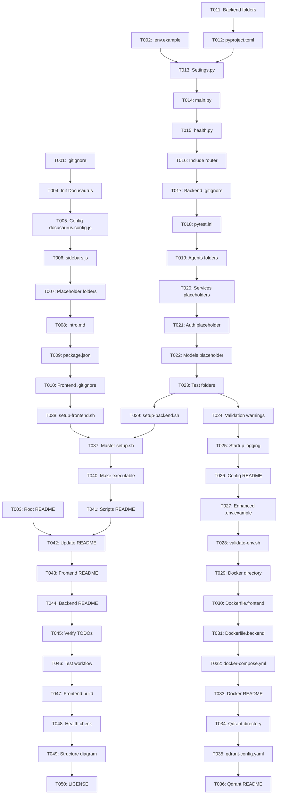

# Tasks: Base Project Initialization

**Feature**: 001-base-project-init | **Branch**: `001-base-project-init` | **Date**: 2025-12-04
**Generated From**: [plan.md](./plan.md) | [spec.md](./spec.md)

**Purpose**: Convert implementation plan into atomic, executable tasks organized by user story priority.

---

## Task Format

```
- [ ] [TaskID] [Priority] [Story] Description with explicit file path
```

**Legend**:
- `TaskID`: Sequential identifier (T001, T002, etc.)
- `Priority`: P1 (Critical), P2 (Important), P3 (Nice-to-have)
- `Story`: US1 (User Story 1), US2 (User Story 2), US3 (User Story 3), SETUP (Initial setup), POLISH (Final touches)

---

## Phase 0: Setup & Prerequisites

**Purpose**: Initialize repository structure and configuration files before creating actual project structure.

- [X] [T001] [P1] [SETUP] Create `.gitignore` file in repository root excluding `.env`, `node_modules/`, `__pycache__/`, `.venv/`, `build/`, `dist/`, `.docusaurus/`, `.DS_Store`, `*.pyc`, `*.egg-info/`, IDE files
- [X] [T002] [P1] [SETUP] Create `.env.example` file in repository root with all required environment variables documented (OPENAI_API_KEY, QDRANT_URL, QDRANT_API_KEY, DATABASE_URL, BETTERAUTH_SECRET, SMTP_HOST, SMTP_PORT, SMTP_USER, SMTP_PASSWORD, NODE_ENV, PORT_FRONTEND, PORT_BACKEND)
- [X] [T003] [P1] [SETUP] Create `README.md` in repository root with project overview, prerequisites (Node.js 18+, Python 3.11+), setup instructions, and links to quickstart guide

**Success Criteria**:
- `.gitignore` exists and covers all artifact patterns
- `.env.example` documents all 12 environment variables with descriptions
- `README.md` provides complete setup instructions

**Dependencies**: None (can execute immediately)

---

## Phase 1: User Story 1 - Development Environment Setup (P1)

**User Story**: As a developer joining the project, I need to clone the repository and get a working development environment running locally so that I can start contributing immediately.

**Test Strategy**: Can be fully tested by cloning repository, following README, and verifying both services start with health checks passing.

### Frontend Setup (Docusaurus)

- [ ] [T004] [P1] [US1] Initialize Docusaurus project: Run `npx create-docusaurus@latest frontend classic --typescript` to create frontend directory with Docusaurus 3.x
- [ ] [T005] [P1] [US1] Configure `frontend/docusaurus.config.js` with project metadata: title="AI-Native Physical AI & Robotics Textbook", tagline, i18n defaultLocale='en', navbar, footer
- [ ] [T006] [P1] [US1] Create `frontend/sidebars.js` with default sidebar configuration for documentation structure
- [ ] [T007] [P1] [US1] Create placeholder folders with `.gitkeep` files: `frontend/src/components/`, `frontend/src/theme/`, `frontend/src/styles/`, `frontend/src/agents/`
- [ ] [T008] [P1] [US1] Create `frontend/docs/intro.md` with welcome content and navigation instructions
- [ ] [T009] [P1] [US1] Update `frontend/package.json` to ensure correct project name, version (0.1.0), and engines requirement (Node.js >=18.0.0)
- [ ] [T010] [P1] [US1] Create `frontend/.gitignore` with Docusaurus-specific ignores: `.docusaurus/`, `build/`, `node_modules/`, `.cache/`

**Acceptance Test**: Run `cd frontend && npm install && npm start` - should serve at localhost:3000 with intro page visible

### Backend Setup (FastAPI)

- [ ] [T011] [P1] [US1] Create backend folder structure: `backend/app/`, `backend/tests/`, create `backend/app/__init__.py`
- [ ] [T012] [P1] [US1] Create `backend/pyproject.toml` with project metadata, Python >=3.11 requirement, dependencies (fastapi>=0.109.0, uvicorn[standard]>=0.27.0, pydantic>=2.5.0, pydantic-settings>=2.1.0, python-dotenv>=1.0.0), and placeholder dependencies (qdrant-client, openai, psycopg2-binary, sqlalchemy)
- [ ] [T013] [P1] [US1] Create `backend/app/config/__init__.py` and `backend/app/config/settings.py` with Pydantic Settings class loading environment variables (see data-model.md for complete schema)
- [ ] [T014] [P1] [US1] Create `backend/app/main.py` with FastAPI application instance, app metadata (title, version, description), CORS middleware for localhost:3000
- [ ] [T015] [P1] [US1] Create `backend/app/api/__init__.py` and `backend/app/api/health.py` with GET /health endpoint returning `{"status": "healthy", "timestamp": "<ISO 8601>"}` (see contracts/health-api.yaml)
- [ ] [T016] [P1] [US1] Update `backend/app/main.py` to include health router with tag "health"
- [ ] [T017] [P1] [US1] Create `backend/.gitignore` with Python-specific ignores: `__pycache__/`, `*.pyc`, `.venv/`, `*.egg-info/`, `.pytest_cache/`
- [ ] [T018] [P1] [US1] Create `backend/pytest.ini` with pytest configuration: asyncio_mode="auto", testpaths=["tests"]

**Acceptance Test**: Run `cd backend && python3 -m venv .venv && source .venv/bin/activate && pip install -e . && uvicorn app.main:app` - should serve at localhost:8000 with /health returning 200 status

### Project Structure Completion

- [ ] [T019] [P1] [US1] Create AI agent folder structure: `backend/app/agents/__init__.py`, `backend/app/agents/subagents/__init__.py`, `backend/app/agents/subagents/.gitkeep`, `backend/app/agents/skills/__init__.py`, `backend/app/agents/skills/.gitkeep`
- [ ] [T020] [P1] [US1] Create placeholder service files: `backend/app/services/__init__.py`, `backend/app/services/qdrant_client.py` (with TODO comment), `backend/app/services/openai_client.py` (with TODO comment)
- [ ] [T021] [P1] [US1] Create placeholder authentication folder: `backend/app/auth/__init__.py`, `backend/app/auth/better_auth_config.py` (with TODO comment for BetterAuth integration)
- [ ] [T022] [P1] [US1] Create placeholder models folder: `backend/app/models/__init__.py`, `backend/app/models/.gitkeep`
- [ ] [T023] [P1] [US1] Create test folder structure: `backend/tests/__init__.py`, `backend/tests/unit/__init__.py`, `backend/tests/unit/.gitkeep`, `backend/tests/integration/__init__.py`, `backend/tests/integration/.gitkeep`, `backend/tests/contract/__init__.py`, `backend/tests/contract/.gitkeep`

**Acceptance Test**: Run `find . -name ".gitkeep" | wc -l` - should find all expected placeholder folders

**Phase 1 Success Criteria**:
- ✅ SC-001: Frontend setup completes in < 10 minutes
- ✅ SC-002: Backend setup completes in < 10 minutes
- ✅ SC-003: Project structure matches plan.md specification exactly
- ✅ SC-004: `npm install` and `pip install -e .` complete without errors

---

## Phase 2: User Story 2 - Configuration Management (P2)

**User Story**: As a developer, I need to configure environment variables for third-party services so that I can connect the application to external dependencies without exposing secrets.

**Test Strategy**: Can be tested by copying .env.example to .env and verifying application loads configuration correctly.

- [ ] [T024] [P2] [US2] Enhance `backend/app/config/settings.py` to include validation warnings for missing optional variables (log warnings on startup if API keys not set)
- [ ] [T025] [P2] [US2] Update `backend/app/main.py` to include startup event that logs loaded configuration status (which services are configured vs. missing)
- [ ] [T026] [P2] [US2] Create `backend/app/config/README.md` documenting configuration strategy, Pydantic Settings usage, and how to add new environment variables
- [ ] [T027] [P2] [US2] Enhance `.env.example` with detailed comments for each variable explaining purpose, format, where to obtain credentials, and whether required or optional
- [ ] [T028] [P2] [US2] Create validation script `scripts/validate-env.sh` that checks if .env exists and has all required variables (exits with helpful error messages if missing critical ones)

**Acceptance Test**: Copy `.env.example` to `.env`, leave values as placeholders, start backend - should start successfully with warnings logged for missing credentials but no errors

**Phase 2 Success Criteria**:
- ✅ SC-005: .env.example documents all variables with clear descriptions
- ✅ Backend starts without errors even when environment variables are missing (with warnings)

---

## Phase 3: User Story 3 - Build and Deployment Readiness (P3)

**User Story**: As a DevOps engineer, I need Docker configuration files and build scripts so that I can containerize the application and prepare for deployment.

**Test Strategy**: Can be tested by running Docker build commands and verifying containers are created successfully.

### Docker Configuration

- [ ] [T029] [P3] [US3] Create `infrastructure/docker/` directory
- [ ] [T030] [P3] [US3] Create `infrastructure/docker/Dockerfile.frontend` with multi-stage build: Stage 1 (node:18-alpine builder with npm ci and npm run build), Stage 2 (nginx:alpine serving static files from build/)
- [ ] [T031] [P3] [US3] Create `infrastructure/docker/Dockerfile.backend` with Python 3.11-slim, pip install, uvicorn command
- [ ] [T032] [P3] [US3] Create `infrastructure/docker/docker-compose.yml` with frontend and backend services, port mappings (3000:80 for frontend, 8000:8000 for backend), environment variables, and dependency relationships
- [ ] [T033] [P3] [US3] Create `infrastructure/docker/README.md` with Docker usage instructions, build commands, troubleshooting tips

### Qdrant Configuration Placeholder

- [ ] [T034] [P3] [US3] Create `infrastructure/qdrant/` directory
- [ ] [T035] [P3] [US3] Create `infrastructure/qdrant/qdrant-config.yaml` with placeholder configuration for future vector database setup (collection name, vector dimensions, distance metric - all as TODO comments)
- [ ] [T036] [P3] [US3] Create `infrastructure/qdrant/README.md` documenting that this is a placeholder for future RAG feature implementation

### Setup Scripts

- [ ] [T037] [P3] [US3] Create `scripts/setup.sh` master setup script that checks prerequisites (node, python3, git), runs frontend and backend setup, copies .env.example to .env if not exists, prints success message with next steps
- [ ] [T038] [P3] [US3] Create `scripts/setup-frontend.sh` that navigates to frontend/, runs npm install, prints completion status
- [ ] [T039] [P3] [US3] Create `scripts/setup-backend.sh` that navigates to backend/, creates .venv, activates virtualenv, runs pip install -e ., prints completion status
- [ ] [T040] [P3] [US3] Make all scripts executable: `chmod +x scripts/*.sh`
- [ ] [T041] [P3] [US3] Create `scripts/README.md` documenting purpose of each script and usage examples

**Acceptance Test**: Run `docker build -f infrastructure/docker/Dockerfile.frontend -t ai-textbook-frontend:latest .` and `docker build -f infrastructure/docker/Dockerfile.backend -t ai-textbook-backend:latest .` - both should build successfully

**Phase 3 Success Criteria**:
- ✅ SC-006: Docker build commands succeed for both frontend and backend
- ✅ SC-007: 100% of specified folders exist (verified with directory tree command)

---

## Phase 4: Documentation & Polish (Final)

**Purpose**: Complete documentation and ensure repository is developer-ready.

- [ ] [T042] [P2] [POLISH] Update root `README.md` with comprehensive setup guide referencing `specs/001-base-project-init/quickstart.md`, project structure overview, links to constitution, contribution guidelines placeholder
- [ ] [T043] [P2] [POLISH] Create `frontend/README.md` with Docusaurus-specific documentation: how to add pages, customize theme, add components
- [ ] [T044] [P2] [POLISH] Create `backend/README.md` with FastAPI-specific documentation: how to add endpoints, create services, run tests, add dependencies
- [ ] [T045] [P2] [POLISH] Verify all placeholder files have clear TODO comments indicating future implementation
- [ ] [T046] [P1] [POLISH] Test complete setup workflow following quickstart.md on clean system (or clean Docker container) to ensure < 10 minute setup time
- [ ] [T047] [P1] [POLISH] Run frontend build: `cd frontend && npm run build` - should complete without errors
- [ ] [T048] [P1] [POLISH] Verify backend health endpoint responds correctly: `curl http://localhost:8000/health` returns expected JSON with status and timestamp
- [ ] [T049] [P2] [POLISH] Create project structure diagram in root README.md or separate STRUCTURE.md file
- [ ] [T050] [P2] [POLISH] Add LICENSE file (MIT or other appropriate license)

**Final Validation Checklist**:
- [ ] All 50 tasks completed
- [ ] Frontend serves at localhost:3000 with default Docusaurus page
- [ ] Backend serves at localhost:8000 with /health endpoint returning 200
- [ ] All placeholder folders exist with .gitkeep files
- [ ] .env.example documents all required variables
- [ ] README.md provides complete setup instructions
- [ ] Docker builds succeed
- [ ] Setup time < 10 minutes on clean system

---

## Dependency Graph



---

## Parallel Execution Opportunities

**Can Execute in Parallel** (no dependencies between groups):

**Group A - Initial Setup** (Execute first):
- T001, T002, T003 (All independent)

**Group B - Frontend Stream** (After T001):
- T004 → T005 → T006 → T007 → T008 → T009 → T010

**Group C - Backend Stream** (After T002):
- T011 → T012 → T013 → T014 → T015 → T016 → T017 → T018 → T019 → T020 → T021 → T022 → T023

**Group D - Configuration Enhancements** (After Group B and C):
- T024 → T025 → T026 → T027 → T028

**Group E - Infrastructure** (After Group D):
- T029 → T030 → T031 → T032 → T033 (Docker stream)
- T034 → T035 → T036 (Qdrant stream, can run parallel to Docker)

**Group F - Scripts** (After T010 and T023):
- T038 (Frontend script)
- T039 (Backend script)
- Then T037 → T040 → T041

**Group G - Documentation** (After all implementation):
- T042 → T043 → T044 → T045

**Group H - Validation** (Must be sequential at end):
- T046 → T047 → T048 → T049 → T050

**Optimal Execution Strategy**:
1. Execute Group A (3 tasks in parallel)
2. Execute Group B and Group C simultaneously (2 parallel streams)
3. Execute Group D (sequential within group)
4. Execute Group E (Docker and Qdrant in parallel)
5. Execute Group F (2 scripts in parallel, then master script)
6. Execute Group G (documentation tasks)
7. Execute Group H (validation tasks sequentially)

**Total Estimated Tasks**: 50 tasks
**Critical Path Length**: ~25 tasks (if perfect parallelization)
**Realistic Execution**: 2-3 hours for experienced developer

---

## Test Strategy per User Story

### User Story 1 - Development Environment Setup (P1)
**Test Approach**: Integration testing of complete setup workflow

**Test Cases**:
1. **TC-US1-001**: Fresh clone → Run frontend setup → Verify localhost:3000 shows Docusaurus
2. **TC-US1-002**: Fresh clone → Run backend setup → Verify localhost:8000/health returns 200
3. **TC-US1-003**: Verify all folder structure matches plan.md project structure section exactly
4. **TC-US1-004**: Run `npm install` and `pip install -e .` on clean system → Both complete without errors

**Validation**: Manual testing following quickstart.md on clean VM or Docker container

### User Story 2 - Configuration Management (P2)
**Test Approach**: Configuration validation and error handling

**Test Cases**:
1. **TC-US2-001**: Copy .env.example → Start backend with empty values → Verify warnings logged but no errors
2. **TC-US2-002**: Review .env.example → Verify all 12 variables documented with clear descriptions
3. **TC-US2-003**: Run validate-env.sh without .env → Verify helpful error messages
4. **TC-US2-004**: Start backend → Check logs → Verify configuration status message indicates which services are available

**Validation**: Automated script testing + manual log review

### User Story 3 - Build and Deployment Readiness (P3)
**Test Approach**: Docker build validation and script execution testing

**Test Cases**:
1. **TC-US3-001**: Run `docker build -f infrastructure/docker/Dockerfile.frontend ...` → Build succeeds
2. **TC-US3-002**: Run `docker build -f infrastructure/docker/Dockerfile.backend ...` → Build succeeds
3. **TC-US3-003**: Run `docker-compose up` → Both services start and can communicate
4. **TC-US3-004**: Run master setup script `./scripts/setup.sh` → Completes successfully with all checks passed

**Validation**: CI/CD pipeline simulation or manual Docker testing

---

## Risk Analysis

### High Risk Tasks

**T004 (Initialize Docusaurus)**:
- **Risk**: Docusaurus CLI might fail or create unexpected structure
- **Mitigation**: Test on clean system first, document exact command and expected output

**T012 (pyproject.toml)**:
- **Risk**: Dependency version conflicts or installation failures
- **Mitigation**: Use locked versions, test pip install on multiple Python versions (3.11, 3.12)

**T046 (Test complete workflow)**:
- **Risk**: Setup time exceeds 10 minute target
- **Mitigation**: Optimize dependency installation, provide troubleshooting guide, consider caching strategies

### Medium Risk Tasks

**T030-T032 (Docker files)**:
- **Risk**: Docker builds fail due to missing dependencies or incorrect paths
- **Mitigation**: Use official base images, test builds incrementally

**T037 (Master setup script)**:
- **Risk**: Cross-platform compatibility issues (Windows vs Unix)
- **Mitigation**: Use platform-agnostic commands, provide platform-specific alternatives in README

---

## Success Metrics

**Code Metrics**:
- ~50 files created
- ~10 configuration files
- ~20 placeholder folders with .gitkeep
- 0 business logic (infrastructure only)

**Time Metrics**:
- Setup time: < 10 minutes (SC-001, SC-002)
- Build time: < 30 seconds for frontend build
- Startup time: < 5 seconds for backend

**Quality Metrics**:
- 100% folder structure completeness (SC-007)
- 100% environment variable documentation (SC-005)
- 0 errors on clean system setup (SC-004)
- Docker builds: 100% success rate (SC-006)

---

**Task Generation Complete**: 2025-12-04
**Ready for Implementation**: Yes ✅
**Next Command**: `/sp.implement` (or manual task-by-task execution)
