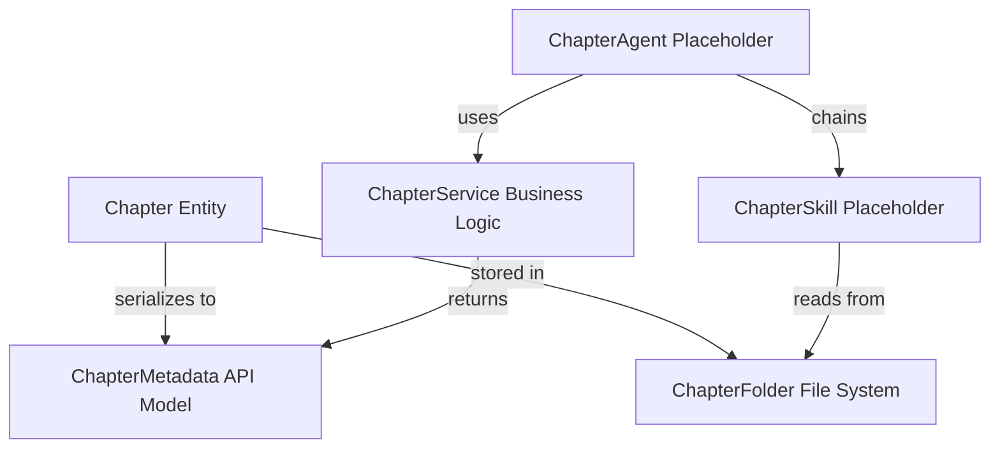
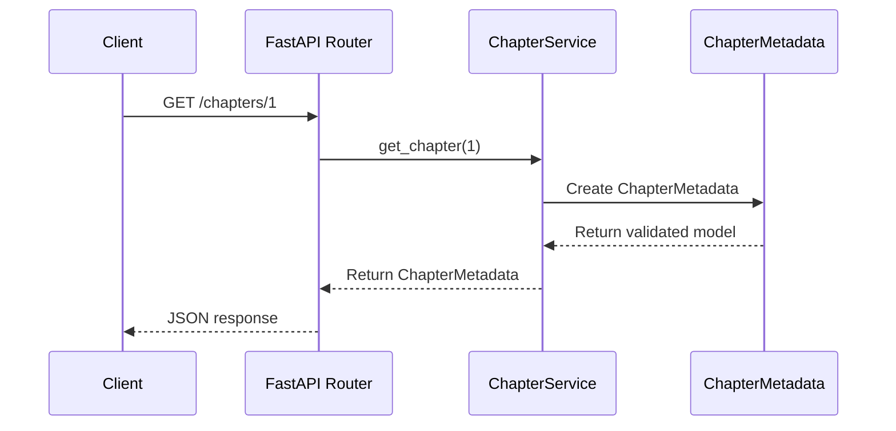
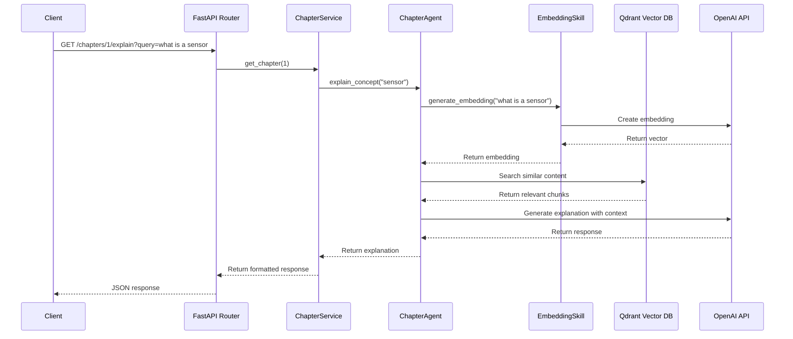

# Data Model: Chapter 1 Core Implementation

**Feature**: 002-chapter-1-core
**Date**: 2025-12-05
**Purpose**: Define entity structures and relationships for Chapter 1 infrastructure

## Overview

This document defines the data model for Feature 002, focusing on the structural representation of chapters, metadata, and placeholder scaffolding. This is **infrastructure-focused** (not educational content).

---

## Entity Definitions

### Entity 1: Chapter

**Description**: Represents a single chapter in the textbook with associated metadata and content references.

**Attributes**:
- `chapter: int` - Unique chapter number (1, 2, 3, ..., 99)
- `title: str` - Full chapter title (e.g., "Introduction to Physical AI & Robotics")
- `summary: str` - Brief description of chapter content (50-300 chars)
- `sections: List[str]` - Ordered list of section titles within the chapter

**Constraints**:
- `chapter` must be positive integer ≥ 1
- `title` must be 10-200 characters
- `summary` must be 50-1000 characters
- `sections` can be empty array (for scaffolding phase)

**Example**:
```python
{
    "chapter": 1,
    "title": "Introduction to Physical AI & Robotics",
    "summary": "Placeholder summary for Chapter 1 introduction",
    "sections": []
}
```

**Relationships**:
- Has many: Sections (future implementation)
- Has many: Learning objectives (future implementation)
- Has many: RAG embeddings (future implementation)

---

### Entity 2: ChapterMetadata (API Response Model)

**Description**: Pydantic model representing chapter metadata returned by API endpoints.

**Attributes**:
- `chapter: int` - Chapter number (≥1, validated)
- `title: str` - Chapter title (10-200 chars, validated)
- `summary: str` - Chapter description (50-1000 chars, validated)
- `sections: List[str]` - Section titles (default empty list)

**Validation Rules**:
- All fields required (no None values)
- Integer must be positive: `ge=1`
- String lengths enforced via `min_length` and `max_length`
- Response conforms to JSON serialization

**Pydantic Schema**:
```python
class ChapterMetadata(BaseModel):
    chapter: int = Field(..., ge=1, example=1)
    title: str = Field(..., min_length=10, max_length=200)
    summary: str = Field(..., min_length=50, max_length=1000)
    sections: List[str] = Field(default_factory=list)
```

**Used By**:
- FastAPI endpoint: `GET /chapters/{chapter_id}`
- ChapterService: `get_chapter()` return type
- API documentation (OpenAPI/Swagger)

---

### Entity 3: ChapterFolder

**Description**: File system representation of chapter content organization.

**Structure**:
```
/chapters/01-introduction/
    └── .gitkeep

/content/01-introduction/
    ├── raw/
    │   └── .gitkeep
    └── processed/
        └── .gitkeep
```

**Attributes**:
- `chapter_number: str` - Zero-padded chapter number (e.g., "01", "02", "03")
- `chapter_name: str` - URL-friendly chapter name (e.g., "introduction", "sensors")
- `raw_content_path: Path` - Location of source content
- `processed_content_path: Path` - Location of RAG-processed content

**Constraints**:
- Folder names must use zero-padding: 01-99 (for alphabetical sorting)
- Names must be lowercase, kebab-case (no spaces, underscores, or special chars)
- Both raw/ and processed/ subdirectories required
- .gitkeep files preserve empty directories in version control

**Purpose**:
- **Raw Content**: Store source markdown, images, videos, interactive widgets
- **Processed Content**: Store embeddings, chunked text, metadata JSON, indexed data

---

### Entity 4: ChapterAgent (Placeholder)

**Description**: AI agent that interacts with chapter content using RAG techniques.

**Types** (documented in placeholder file):
1. **ChapterExplainerAgent** - Answers questions about chapter concepts
2. **ChapterQuizAgent** - Generates adaptive quizzes
3. **ChapterNavigatorAgent** - Recommends chapters based on goals
4. **ChapterSummarizerAgent** - Creates dynamic summaries

**Attributes** (future implementation):
- `agent_id: str` - Unique identifier
- `agent_type: str` - One of the 4 types above
- `chapter_scope: List[int]` - Chapters this agent can access
- `llm_config: Dict` - LLM provider and model configuration

**Capabilities** (documented, not implemented):
- Query vector database for relevant context
- Generate responses using LLM with RAG context
- Track user interactions for content improvement
- Adapt responses based on user proficiency level

---

### Entity 5: ChapterSkill (Placeholder)

**Description**: Reusable atomic capability that agents use to interact with chapter content.

**Types** (documented in placeholder file):
1. **EmbeddingSkill** - Generate vector embeddings
2. **VectorSearchSkill** - Query Qdrant database
3. **ChunkingSkill** - Split content into optimal chunks
4. **ContextRetrievalSkill** - Retrieve relevant context
5. **GlossarySkill** - Lookup term definitions
6. **ProgressTrackingSkill** - Track user progress
7. **ValidationSkill** - Validate content structure

**Attributes** (future implementation):
- `skill_id: str` - Unique identifier
- `skill_type: str` - One of the 7 types above
- `dependencies: List[str]` - Other skills required
- `config: Dict` - Skill-specific configuration

**Usage Pattern**:
- Skills are stateless and composable
- Agents chain skills together to perform complex operations
- Skills have single responsibility (one capability each)

---

### Entity 6: ChapterService

**Description**: Service layer providing business logic for chapter operations.

**Methods**:
- `get_chapter(chapter_id: int) -> Optional[ChapterMetadata]` - Retrieve single chapter
- `list_chapters() -> List[ChapterMetadata]` - Retrieve all chapters

**Future Methods** (documented as TODOs):
- `search_chapters(query: str) -> List[ChapterMetadata]` - Semantic search
- `recommend_chapters(user_id: str) -> List[ChapterMetadata]` - Personalized recommendations
- `generate_embeddings(chapter_id: int) -> None` - Create vector embeddings
- `get_related_chapters(chapter_id: int) -> List[ChapterMetadata]` - Find similar chapters

**Responsibilities**:
- Encapsulate chapter retrieval logic
- Integration point for future RAG functionality
- Error handling and validation
- Caching (future)

---

## Entity Relationships



**Key Relationships**:
1. **Chapter → ChapterMetadata**: One-to-one mapping for API responses
2. **Chapter → ChapterFolder**: One-to-one mapping for file storage
3. **ChapterService → ChapterMetadata**: Service returns API models
4. **ChapterAgent → ChapterService**: Agents use service layer (future)
5. **ChapterAgent → ChapterSkill**: Agents chain skills (future)
6. **ChapterSkill → ChapterFolder**: Skills read content (future)

---

## Data Flow

### Current Implementation (Scaffolding Phase)



### Future Implementation (RAG Integration)



---

## Validation Rules

### Field-Level Validation

| Field | Type | Min | Max | Pattern | Example |
|-------|------|-----|-----|---------|---------|
| chapter | int | 1 | 99 | N/A | 1 |
| title | str | 10 | 200 | N/A | "Introduction to Physical AI & Robotics" |
| summary | str | 50 | 1000 | N/A | "Placeholder summary..." |
| sections | List[str] | 0 items | 20 items | N/A | [] |

### Business Logic Validation

- **Unique Chapter IDs**: Each chapter number must be unique across the system
- **Sequential Numbering**: Chapters should be numbered sequentially (1, 2, 3...) without gaps
- **Folder Name Consistency**: Folder names must match chapter IDs with zero-padding
- **Section Order**: Section titles must maintain consistent order across API and content

---

## Storage Considerations

### Current Phase (Scaffolding)
- **No database**: All data is hardcoded in ChapterService
- **File system**: Only .gitkeep files to preserve directory structure
- **API responses**: Served from in-memory data structures

### Future Phase (RAG Integration)
- **Vector database**: Qdrant for embeddings storage
- **Relational database**: PostgreSQL for structured metadata (optional)
- **File system**: Raw markdown in `/content/{id}/raw/`, processed data in `/processed/`
- **Cache layer**: Redis for frequently accessed metadata (optional)

---

## Summary

**6 Entities Defined**:
1. Chapter - Core business entity
2. ChapterMetadata - API response model
3. ChapterFolder - File system structure
4. ChapterAgent - AI agent placeholder (4 types)
5. ChapterSkill - Reusable capability placeholder (7 types)
6. ChapterService - Business logic layer

**Key Design Principles**:
- **Simplicity**: Minimal data model for MVP
- **Extensibility**: Clear extension points for future features
- **Separation**: Business logic (service) separate from API (router) and data (models)
- **RAG-Ready**: Folder structure and placeholders anticipate vector database integration

---

**Next Steps**: Proceed to `contracts/content-schema.md` to define API contracts and validation schemas.
