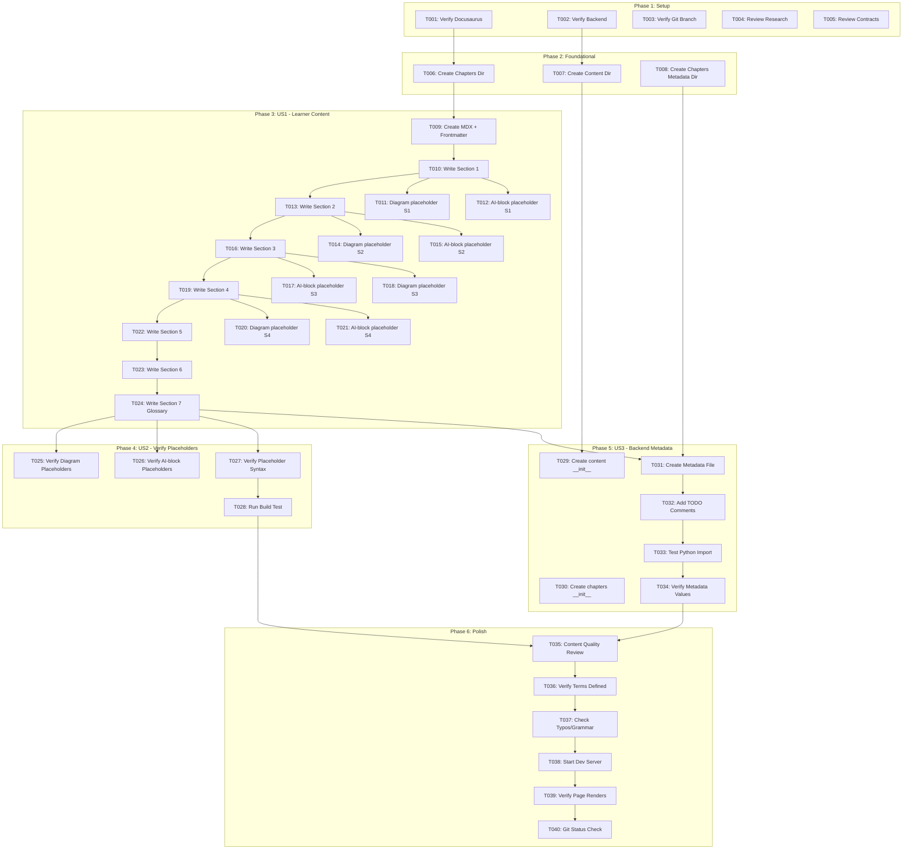

# Task List: Chapter 1 Written Content

**Feature**: 003-chapter-1-content
**Branch**: `003-chapter-1-content`
**Created**: 2025-12-05
**Spec**: [spec.md](spec.md) | **Plan**: [plan.md](plan.md)

## Overview

This task list implements Feature 003 (Chapter 1 Written Content) by creating complete educational content for Chapter 1: "Introduction to Physical AI & Robotics" as an MDX file with strategic placeholders for future diagram and AI-interactive features, plus backend metadata scaffolding for RAG integration.

**Total Tasks**: 20 tasks across 5 phases
**Estimated Time**: 2-4 hours (content writing) + 30 minutes (validation)
**Primary Deliverable**: `frontend/docs/chapters/chapter-1.mdx`
**Secondary Deliverable**: `backend/app/content/chapters/chapter_1.py`

---

## User Stories Summary

### User Story 1 (P1) - Learner Reads Chapter 1 Introduction
**Independent Test**: Navigate to `/docs/chapters/chapter-1` and read through all 7 sections
**Value**: Primary user-facing deliverable - learners can begin learning journey

### User Story 2 (P2) - Content Creator Verifies Structure and Placeholders
**Independent Test**: Open `frontend/docs/chapters/chapter-1.mdx` and search for comment markers
**Value**: Validates readiness for future diagram generation and AI interaction features

### User Story 3 (P3) - Backend System Provides Chapter Metadata
**Independent Test**: Import `backend/app/content/chapters/chapter_1.py` and verify data structure
**Value**: Establishes metadata schema for all future chapters and RAG integration

---

## Phase 1: Setup (Prerequisites)

**Goal**: Verify environment and dependencies are ready for content creation

### Tasks

- [X] T001 Verify Docusaurus frontend is functional at http://localhost:3000
- [X] T002 [P] Verify backend directory structure exists at backend/app/
- [X] T003 [P] Verify git branch 003-chapter-1-content is checked out
- [X] T004 [P] Review research.md content writing guidelines in specs/003-chapter-1-content/research.md
- [X] T005 [P] Review contracts/content-schema.md validation rules in specs/003-chapter-1-content/contracts/content-schema.md

**Phase Completion**: All prerequisites verified, ready to create content

---

## Phase 2: Foundational (Directory Structure)

**Goal**: Create necessary directory structure for chapter content

### Tasks

- [X] T006 Create chapters directory at frontend/docs/chapters/ if it doesn't exist
- [X] T007 Create content metadata directory at backend/app/content/ if it doesn't exist
- [X] T008 Create chapters metadata subdirectory at backend/app/content/chapters/ if it doesn't exist

**Phase Completion**: Directory structure ready for content files

---

## Phase 3: User Story 1 (P1) - Learner Reads Chapter 1 Introduction

**Story Goal**: Provide complete, beginner-friendly content for Chapter 1 that introduces Physical AI and Robotics concepts

**Independent Test**: Navigate to http://localhost:3000/docs/chapters/chapter-1 and verify all 7 sections are readable with appropriate content for 12+ age group

### Tasks

#### 3.1: MDX File Creation & Frontmatter

- [X] T009 [US1] Create MDX file at frontend/docs/chapters/chapter-1.mdx with YAML frontmatter (title, description, sidebar_position, sidebar_label, tags)

#### 3.2: Section 1 - What is Physical AI?

- [X] T010 [US1] Write Section 1 content in frontend/docs/chapters/chapter-1.mdx: definition of Physical AI, differences from Digital AI, 3+ real-world examples (min 200 words, 7th-8th grade level)
- [X] T011 [P] [US1] Add diagram placeholder `<!-- DIAGRAM: physical-ai-overview -->` to Section 1 in frontend/docs/chapters/chapter-1.mdx
- [X] T012 [P] [US1] Add AI-block placeholder `<!-- AI-BLOCK: ask-question -->` to end of Section 1 in frontend/docs/chapters/chapter-1.mdx

#### 3.3: Section 2 - What is a Robot?

- [X] T013 [US1] Write Section 2 content in frontend/docs/chapters/chapter-1.mdx: formal robot definition, components (sensors, actuators, controllers), daily-life examples (min 200 words)
- [X] T014 [P] [US1] Add diagram placeholder `<!-- DIAGRAM: robot-anatomy -->` to Section 2 in frontend/docs/chapters/chapter-1.mdx
- [X] T015 [P] [US1] Add AI-block placeholder `<!-- AI-BLOCK: generate-diagram -->` to Section 2 in frontend/docs/chapters/chapter-1.mdx

#### 3.4: Section 3 - AI + Robotics = Physical AI Systems

- [X] T016 [US1] Write Section 3 content in frontend/docs/chapters/chapter-1.mdx: why robots need AI, autonomy levels, real-world applications (min 200 words)
- [X] T017 [P] [US1] Add AI-block placeholder `<!-- AI-BLOCK: explain-like-i-am-10 -->` to middle of Section 3 in frontend/docs/chapters/chapter-1.mdx
- [X] T018 [P] [US1] Add diagram placeholder `<!-- DIAGRAM: ai-robotics-stack -->` to Section 3 in frontend/docs/chapters/chapter-1.mdx

#### 3.5: Section 4 - Core Concepts Introduced in This Book

- [X] T019 [US1] Write Section 4 content in frontend/docs/chapters/chapter-1.mdx: explanations of 5 core concepts (Embodiment, Perception, Decision-making, Control, Interaction) with example scenarios (min 200 words)
- [X] T020 [P] [US1] Add diagram placeholder `<!-- DIAGRAM: core-concepts-flow -->` to Section 4 in frontend/docs/chapters/chapter-1.mdx
- [X] T021 [P] [US1] Add AI-block placeholder `<!-- AI-BLOCK: interactive-quiz -->` to end of Section 4 in frontend/docs/chapters/chapter-1.mdx

#### 3.6: Section 5 - Learning Objectives

- [X] T022 [US1] Write Section 5 content in frontend/docs/chapters/chapter-1.mdx: 4-6 bullet points with action verbs (Define, Identify, Explain, Recognize) + optional reflection questions

#### 3.7: Section 6 - Summary

- [X] T023 [US1] Write Section 6 content in frontend/docs/chapters/chapter-1.mdx: 6-8 line recap of all sections (150-200 words)

#### 3.8: Section 7 - Glossary

- [X] T024 [US1] Write Section 7 content in frontend/docs/chapters/chapter-1.mdx: exactly 7 glossary terms (Physical AI, Robot, Sensor, Actuator, Autonomy, Perception, Control System) with beginner-friendly definitions (10-100 words each, uses analogies)

**Phase Completion**: User Story 1 complete when learner can navigate to `/docs/chapters/chapter-1` and read all 7 sections

---

## Phase 4: User Story 2 (P2) - Content Creator Verifies Structure and Placeholders

**Story Goal**: Verify MDX file contains all required diagram placeholders and AI-interactive block markers

**Independent Test**: Open `frontend/docs/chapters/chapter-1.mdx` and search for exactly 4 diagram placeholders and 4 AI-block placeholders with correct naming

### Tasks

#### 4.1: Placeholder Verification

- [X] T025 [US2] Verify exactly 4 diagram placeholders in frontend/docs/chapters/chapter-1.mdx: physical-ai-overview, robot-anatomy, ai-robotics-stack, core-concepts-flow (use grep or manual search)
- [X] T026 [US2] Verify exactly 4 AI-block placeholders in frontend/docs/chapters/chapter-1.mdx: ask-question, explain-like-i-am-10, interactive-quiz, generate-diagram (use grep or manual search)
- [X] T027 [US2] Verify all placeholders follow correct HTML comment syntax (no missing spaces, kebab-case naming) in frontend/docs/chapters/chapter-1.mdx

#### 4.2: Build Validation

- [X] T028 [US2] Run `npm run build` in frontend/ directory and verify MDX file compiles without errors

**Phase Completion**: User Story 2 complete when all 8 placeholders verified and build succeeds

---

## Phase 5: User Story 3 (P3) - Backend System Provides Chapter Metadata

**Story Goal**: Backend provides chapter metadata via Python module for future RAG integration

**Independent Test**: Import `backend/app/content/chapters/chapter_1.py` and verify all 13 fields are accessible

### Tasks

#### 5.1: Backend Metadata File Creation

- [X] T029 [P] [US3] Create __init__.py file at backend/app/content/__init__.py with package docstring
- [X] T030 [P] [US3] Create __init__.py file at backend/app/content/chapters/__init__.py with package docstring
- [X] T031 [US3] Create chapter metadata file backend/app/content/chapters/chapter_1.py with CHAPTER_METADATA dictionary containing all 13 required fields (id, title, summary, section_count, sections, ai_blocks, diagram_placeholders, last_updated, difficulty_level, prerequisites, learning_outcomes, glossary_terms)
- [X] T032 [US3] Add TODO comments to backend/app/content/chapters/chapter_1.py documenting future RAG integration points (Pydantic model, Qdrant storage, embedding generation, API endpoint)

#### 5.2: Metadata Validation

- [X] T033 [US3] Test Python import from backend/ directory: `python -c "from app.content.chapters.chapter_1 import CHAPTER_METADATA; print(CHAPTER_METADATA['title'])"` and verify no errors
- [X] T034 [US3] Verify metadata values match MDX content: section_count=7, ai_blocks has 4 items, diagram_placeholders has 4 items, glossary_terms has 7 items

**Phase Completion**: User Story 3 complete when metadata file imports successfully and values match MDX content

---

## Phase 6: Polish & Cross-Cutting Concerns

**Goal**: Final validation and quality checks across all user stories

### Tasks

#### 6.1: Content Quality Review

- [X] T035 Review all 7 sections in frontend/docs/chapters/chapter-1.mdx for reading level (7th-8th grade), tone (conversational-educational), paragraph length (3-4 sentences max)
- [X] T036 Verify all technical terms are defined before use in frontend/docs/chapters/chapter-1.mdx
- [X] T037 Check for typos, grammar errors, and formatting issues in frontend/docs/chapters/chapter-1.mdx

#### 6.2: Dev Server Testing

- [X] T038 Start Docusaurus dev server (`npm start` in frontend/) and navigate to http://localhost:3000/docs/chapters/chapter-1
- [X] T039 Verify page renders without errors, title displays correctly, sidebar shows "Chapter 1: Intro to Physical AI", all 7 sections visible

#### 6.3: Git Tracking

- [X] T040 Run `git status` and verify both files are tracked: frontend/docs/chapters/chapter-1.mdx and backend/app/content/chapters/chapter_1.py

**Phase Completion**: Feature 003 complete when all quality checks pass and files are tracked in git

---

## Dependency Graph



---

## Parallel Execution Opportunities

### Within Phase 1 (Setup)
**All setup tasks are independent and can run in parallel**:
- T001, T002, T003, T004, T005 can all run simultaneously

### Within Phase 2 (Foundational)
**Directory creation can be parallelized**:
- T007 and T008 depend on directory structure but can run in parallel after T006

### Within Phase 3 (US1 - Content Creation)
**Placeholder tasks are parallelizable after their parent section is written**:
- After T010 completes: T011 and T012 can run in parallel
- After T013 completes: T014 and T015 can run in parallel
- After T016 completes: T017 and T018 can run in parallel
- After T019 completes: T020 and T021 can run in parallel

**Example Parallel Batch**:
```
Batch 1: T010 (write section 1)
Batch 2 (parallel): T011 (diagram placeholder), T012 (AI-block placeholder)
Batch 3: T013 (write section 2)
Batch 4 (parallel): T014 (diagram placeholder), T015 (AI-block placeholder)
```

### Within Phase 4 (US2 - Verification)
**Verification tasks can be parallelized**:
- T025, T026, T027 can all run in parallel (different search operations on same file)

### Between Phase 4 and Phase 5
**User Story 2 and User Story 3 are completely independent**:
- Phase 4 (T025-T028) and Phase 5 (T029-T034) can run in parallel
- Both depend on Phase 3 completion but not on each other

### Within Phase 6 (Polish)
**Review tasks are sequential but can use multiple reviewers**:
- T035, T036, T037 can be done by different people simultaneously
- T038-T040 are sequential (must test running server)

---

## Implementation Strategy

### MVP Scope (Minimum Viable Product)
**User Story 1 ONLY** (Tasks T001-T024):
- Provides immediate learner value
- Deliverable: Readable Chapter 1 content at `/docs/chapters/chapter-1`
- Estimated Time: 2-3 hours

### Incremental Delivery

**Iteration 1 - MVP (User Story 1)**:
- Tasks: T001-T024
- Deliverable: Complete chapter content readable by learners
- Independent Test: Navigate to chapter page and read all 7 sections

**Iteration 2 - Placeholder Validation (User Story 2)**:
- Tasks: T025-T028
- Deliverable: Verified placeholder structure for future features
- Independent Test: Search MDX file for all 8 placeholders and run build

**Iteration 3 - Backend Scaffolding (User Story 3)**:
- Tasks: T029-T034
- Deliverable: Metadata schema for RAG integration
- Independent Test: Import Python module and access metadata fields

**Iteration 4 - Polish (Cross-Cutting)**:
- Tasks: T035-T040
- Deliverable: Quality-assured, production-ready content
- Independent Test: Dev server renders without errors, files tracked in git

### Why This Order?

1. **User Story 1 (P1)** delivers immediate learner value
2. **User Story 2 (P2)** validates infrastructure for future features
3. **User Story 3 (P3)** scaffolds backend integration (no immediate user impact)
4. **Polish** ensures quality across all deliverables

Each iteration is **independently testable** and **delivers value** even if subsequent iterations are not completed.

---

## Acceptance Criteria Checklist

### User Story 1 (P1) - Learner Content
- [ ] Page accessible at http://localhost:3000/docs/chapters/chapter-1
- [ ] Title displays "Chapter 1 — Introduction to Physical AI & Robotics"
- [ ] All 7 sections present in correct order
- [ ] Section 1 includes Physical AI definition, differences, and examples
- [ ] Section 2 includes robot definition and components
- [ ] Section 3 includes AI + robotics integration and autonomy levels
- [ ] Section 4 includes 5 core concepts with examples
- [ ] Section 5 includes learning objectives with action verbs
- [ ] Section 6 includes 6-8 line summary
- [ ] Section 7 includes exactly 7 glossary terms with definitions
- [ ] Content is readable for 12+ age group (7th-8th grade level)

### User Story 2 (P2) - Placeholder Verification
- [ ] Exactly 4 diagram placeholders present with correct names
- [ ] Exactly 4 AI-block placeholders present with correct types
- [ ] All placeholders use correct HTML comment syntax
- [ ] `npm run build` completes without errors

### User Story 3 (P3) - Backend Metadata
- [ ] File exists at `backend/app/content/chapters/chapter_1.py`
- [ ] Python import succeeds: `from app.content.chapters.chapter_1 import CHAPTER_METADATA`
- [ ] All 13 metadata fields accessible
- [ ] Metadata values match MDX content (section_count, placeholder counts, etc.)
- [ ] TODO comments document future RAG integration

### Cross-Cutting (Polish)
- [ ] Content reviewed for quality (tone, reading level, accuracy)
- [ ] No typos or grammar errors
- [ ] Dev server renders page without errors
- [ ] Sidebar shows "Chapter 1: Intro to Physical AI"
- [ ] Both files tracked in git

---

## Task Execution Notes

### Content Writing Guidelines
- **Tone**: Conversational but educational, use "you" to address learner directly
- **Paragraph Length**: Maximum 3-4 sentences per paragraph
- **Sentence Length**: Average 15-20 words (7th-8th grade level)
- **Examples**: Use daily-life analogies (smartphones, household appliances)
- **Technical Terms**: Define in-line before repeated use
- **Engagement**: Use rhetorical questions and "imagine if..." scenarios

### Placeholder Format (CRITICAL)
**Diagram Placeholder**:
```html
<!-- DIAGRAM: placeholder-name -->
```
- Correct: `<!-- DIAGRAM: physical-ai-overview -->`
- Wrong: `<!--DIAGRAM: no-space-->` ❌
- Wrong: `<!-- DIAGRAM: CamelCase -->` ❌

**AI-Block Placeholder**:
```html
<!-- AI-BLOCK: block-type -->
```
- Correct: `<!-- AI-BLOCK: ask-question -->`
- Wrong: `<!-- AI-BLOCK: custom-type -->` ❌
- Wrong: `<!-- AI-BLOCK: askQuestion -->` ❌

### Glossary Term Format
```markdown
**Term Name**: Definition text (10-100 words, uses analogies).
```
- Correct: `**Physical AI**: Artificial intelligence systems that...`
- Wrong: `Physical AI: No bold` ❌
- Wrong: `**Physical AI** : Space before colon` ❌

### Metadata Synchronization
**CRITICAL**: Metadata values in `backend/app/content/chapters/chapter_1.py` MUST match MDX content exactly:
- `section_count` = number of H2 sections (7)
- `sections[]` = H2 heading text in order
- `ai_blocks[]` = AI-block types in MDX (4 items)
- `diagram_placeholders[]` = diagram names in MDX (4 items)
- `glossary_terms[]` = terms defined in Section 7 (7 items)

---

## Troubleshooting

### Issue: Docusaurus build fails with "Unexpected token"
**Cause**: MDX syntax error (unescaped braces, invalid JSX)
**Solution**: Check for unescaped `{`, `}`, `<`, `>` characters; verify HTML comment syntax

### Issue: Backend import fails with "No module named 'app'"
**Cause**: Missing `__init__.py` files or incorrect directory structure
**Solution**: Ensure `__init__.py` exists in `backend/app/`, `backend/app/content/`, `backend/app/content/chapters/`

### Issue: Content feels too technical or too simple
**Cause**: Mismatched reading level or audience assumptions
**Solution**: Review research.md writing guidelines, check Flesch-Kincaid readability score (target: 7th-8th grade), get feedback from target audience

---

## Summary

**Total Tasks**: 40 tasks
**User Story Breakdown**:
- User Story 1 (P1): 16 tasks (T009-T024) - 2-3 hours
- User Story 2 (P2): 4 tasks (T025-T028) - 15 minutes
- User Story 3 (P3): 6 tasks (T029-T034) - 30 minutes
- Setup: 5 tasks (T001-T005) - 10 minutes
- Foundational: 3 tasks (T006-T008) - 5 minutes
- Polish: 6 tasks (T035-T040) - 15 minutes

**Parallel Opportunities**: 18 tasks can be parallelized (marked with [P])

**Independent Test Criteria**: Each user story has clear independent test that can be executed without implementing other stories

**MVP**: User Story 1 alone (T001-T024) delivers functional chapter content for learners

**Next Steps**: Begin with Phase 1 (Setup) tasks, then proceed to User Story 1 (MVP) for maximum learner value
