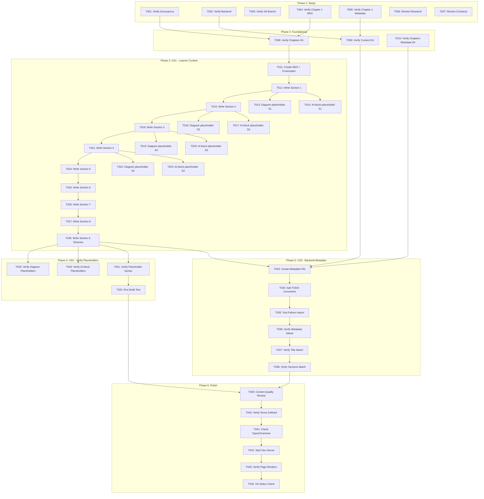

# Task List: Chapter 2 Written Content

**Feature**: 010-chapter-2-content
**Branch**: `010-chapter-2-content`
**Created**: 2025-12-05
**Spec**: [spec.md](spec.md) | **Plan**: [plan.md](plan.md)

## Overview

This task list implements Feature 010 (Chapter 2 Written Content) by creating complete educational content for Chapter 2: "ROS 2 Fundamentals" as an MDX file with strategic placeholders for future diagram and AI-interactive features, plus backend metadata scaffolding for RAG integration. Chapter 2 requires Chapter 1 as prerequisite.

**Total Tasks**: 41 tasks across 6 phases
**Estimated Time**: 2-4 hours (content writing) + 30 minutes (validation)
**Primary Deliverable**: `frontend/docs/chapters/chapter-2.mdx`
**Secondary Deliverable**: `backend/app/content/chapters/chapter_2.py`

---

## User Stories Summary

### User Story 1 (P1) - Learner Reads Chapter 2 ROS 2 Fundamentals
**Independent Test**: Navigate to `/docs/chapters/chapter-2` and read through all 7 sections
**Value**: Primary user-facing deliverable - learners can learn ROS 2 fundamentals after completing Chapter 1

### User Story 2 (P2) - Content Creator Verifies Structure and Placeholders
**Independent Test**: Open `frontend/docs/chapters/chapter-2.mdx` and search for comment markers
**Value**: Validates readiness for future diagram generation and AI interaction features

### User Story 3 (P3) - Backend System Provides Chapter Metadata
**Independent Test**: Import `backend/app/content/chapters/chapter_2.py` and verify data structure with prerequisites=[1]
**Value**: Establishes metadata schema with prerequisites tracking for learning path recommendations

---

## Phase 1: Setup (Prerequisites)

**Goal**: Verify environment, dependencies, and prerequisites are ready for content creation

### Tasks

- [ ] T001 Verify Docusaurus frontend is functional at http://localhost:3000
- [ ] T002 [P] Verify backend directory structure exists at backend/app/
- [ ] T003 [P] Verify git branch 010-chapter-2-content is checked out
- [ ] T004 [P] Verify Chapter 1 exists: Check that frontend/docs/chapters/chapter-1.mdx exists
- [ ] T005 [P] Verify Chapter 1 metadata exists: Check that backend/app/content/chapters/chapter_1.py exists
- [ ] T006 [P] Review research.md content writing guidelines in specs/010-chapter-2-content/research.md
- [ ] T007 [P] Review contracts/content-schema.md validation rules in specs/010-chapter-2-content/contracts/content-schema.md

**Phase Completion**: All prerequisites verified, Chapter 1 dependency confirmed, ready to create content

---

## Phase 2: Foundational (Directory Structure)

**Goal**: Verify necessary directory structure exists (should already exist from Chapter 1)

### Tasks

- [ ] T008 Verify chapters directory exists at frontend/docs/chapters/ (should exist from Chapter 1)
- [ ] T009 Verify content metadata directory exists at backend/app/content/ (should exist from Chapter 1)
- [ ] T010 Verify chapters metadata subdirectory exists at backend/app/content/chapters/ (should exist from Chapter 1)

**Phase Completion**: Directory structure verified (reusing Chapter 1 structure)

---

## Phase 3: User Story 1 (P1) - Learner Reads Chapter 2 ROS 2 Fundamentals

**Story Goal**: Provide complete, beginner-friendly content for Chapter 2 that introduces ROS 2 fundamentals: nodes, topics, services, actions, packages, and launch files

**Independent Test**: Navigate to http://localhost:3000/docs/chapters/chapter-2 and verify all 7 sections are readable with appropriate content for 12+ age group, using ROS 2 analogies (post office, restaurant, phone calls)

### Tasks

#### 3.1: MDX File Creation & Frontmatter

- [ ] T011 [US1] Create MDX file at frontend/docs/chapters/chapter-2.mdx with YAML frontmatter (title="Chapter 2 — ROS 2 Fundamentals", description, sidebar_position=2, sidebar_label, tags=["ros2", "robotics", "programming", "beginner"])

#### 3.2: Section 1 - Introduction to ROS 2

- [ ] T012 [US1] Write Section 1 content in frontend/docs/chapters/chapter-2.mdx: definition of ROS 2, why ROS 2 exists, differences from ROS 1 (brief), 3+ real-world examples (TurtleBot 3, navigation stack, etc.) (min 200 words, 7th-8th grade level, use post office analogy for communication system)
- [ ] T013 [P] [US1] Add diagram placeholder `<!-- DIAGRAM: ros2-ecosystem-overview -->` to Section 1 in frontend/docs/chapters/chapter-2.mdx
- [ ] T014 [P] [US1] Add AI-block placeholder `<!-- AI-BLOCK: ask-question -->` to end of Section 1 in frontend/docs/chapters/chapter-2.mdx

#### 3.3: Section 2 - Nodes and Node Communication

- [ ] T015 [US1] Write Section 2 content in frontend/docs/chapters/chapter-2.mdx: explanation of what nodes are, how nodes communicate, node lifecycle, examples using restaurant analogy (each chef = node) (min 200 words)
- [ ] T016 [P] [US1] Add diagram placeholder `<!-- DIAGRAM: node-communication-architecture -->` to Section 2 in frontend/docs/chapters/chapter-2.mdx
- [ ] T017 [P] [US1] Add AI-block placeholder `<!-- AI-BLOCK: generate-diagram -->` to Section 2 in frontend/docs/chapters/chapter-2.mdx

#### 3.4: Section 3 - Topics and Messages

- [ ] T018 [US1] Write Section 3 content in frontend/docs/chapters/chapter-2.mdx: explanation of topics (publish/subscribe), message types, topic naming conventions, practical examples using radio broadcast analogy (min 200 words)
- [ ] T019 [P] [US1] Add diagram placeholder `<!-- DIAGRAM: topic-pubsub-flow -->` to Section 3 in frontend/docs/chapters/chapter-2.mdx
- [ ] T020 [P] [US1] Add AI-block placeholder `<!-- AI-BLOCK: explain-like-i-am-10 -->` to middle of Section 3 in frontend/docs/chapters/chapter-2.mdx

#### 3.5: Section 4 - Services and Actions

- [ ] T021 [US1] Write Section 4 content in frontend/docs/chapters/chapter-2.mdx: explanation of services (request/response), actions (long-running tasks), differences between topics/services/actions, when to use each, examples using phone call (services) and package delivery (actions) analogies (min 200 words)
- [ ] T022 [P] [US1] Add diagram placeholder `<!-- DIAGRAM: services-actions-comparison -->` to Section 4 in frontend/docs/chapters/chapter-2.mdx
- [ ] T023 [P] [US1] Add AI-block placeholder `<!-- AI-BLOCK: interactive-quiz -->` to end of Section 4 in frontend/docs/chapters/chapter-2.mdx

#### 3.6: Section 5 - ROS 2 Packages

- [ ] T024 [US1] Write Section 5 content in frontend/docs/chapters/chapter-2.mdx: explanation of ROS 2 packages, package structure, dependencies, how packages organize code (min 200 words)

#### 3.7: Section 6 - Launch Files and Workflows

- [ ] T025 [US1] Write Section 6 content in frontend/docs/chapters/chapter-2.mdx: explanation of launch files, how to start multiple nodes, real-world robotics workflows, common patterns (min 200 words)

#### 3.8: Section 7 - Learning Objectives

- [ ] T026 [US1] Write Section 7 content in frontend/docs/chapters/chapter-2.mdx: 4-6 bullet points with action verbs (Define, Explain, Distinguish, Identify) + optional reflection questions

#### 3.9: Section 8 - Summary

- [ ] T027 [US1] Write Section 8 content in frontend/docs/chapters/chapter-2.mdx: 6-8 line recap of all sections (150-200 words)

#### 3.10: Section 9 - Glossary

- [ ] T028 [US1] Write Section 9 content in frontend/docs/chapters/chapter-2.mdx: exactly 7 glossary terms (ROS 2, Node, Topic, Service, Action, Package, Launch File) with beginner-friendly definitions (10-100 words each, uses analogies from post office, restaurant, phone calls)

**Phase Completion**: User Story 1 complete when learner can navigate to `/docs/chapters/chapter-2` and read all 7 sections

---

## Phase 4: User Story 2 (P2) - Content Creator Verifies Structure and Placeholders

**Story Goal**: Verify MDX file contains all required diagram placeholders and AI-interactive block markers

**Independent Test**: Open `frontend/docs/chapters/chapter-2.mdx` and search for exactly 4 diagram placeholders and 4 AI-block placeholders with correct naming

### Tasks

#### 4.1: Placeholder Verification

- [ ] T029 [US2] Verify exactly 4 diagram placeholders in frontend/docs/chapters/chapter-2.mdx: ros2-ecosystem-overview, node-communication-architecture, topic-pubsub-flow, services-actions-comparison (use grep or manual search)
- [ ] T030 [US2] Verify exactly 4 AI-block placeholders in frontend/docs/chapters/chapter-2.mdx: ask-question, explain-like-i-am-10, interactive-quiz, generate-diagram (use grep or manual search)
- [ ] T031 [US2] Verify all placeholders follow correct HTML comment syntax (no missing spaces, kebab-case naming) in frontend/docs/chapters/chapter-2.mdx

#### 4.2: Build Validation

- [ ] T032 [US2] Run `npm run build` in frontend/ directory and verify MDX file compiles without errors

**Phase Completion**: User Story 2 complete when all 8 placeholders verified and build succeeds

---

## Phase 5: User Story 3 (P3) - Backend System Provides Chapter Metadata

**Story Goal**: Backend provides chapter metadata via Python module for future RAG integration with prerequisites tracking

**Independent Test**: Import `backend/app/content/chapters/chapter_2.py` and verify all 13 fields are accessible, including prerequisites=[1]

### Tasks

#### 5.1: Backend Metadata File Creation

- [ ] T033 [US3] Create chapter metadata file backend/app/content/chapters/chapter_2.py with CHAPTER_METADATA dictionary containing all 13 required fields (id=2, title, summary, section_count=7, sections, ai_blocks, diagram_placeholders, last_updated, difficulty_level="beginner", prerequisites=[1], learning_outcomes, glossary_terms)
- [ ] T034 [US3] Add TODO comments to backend/app/content/chapters/chapter_2.py documenting future RAG integration points (Pydantic model, Qdrant storage, embedding generation, API endpoint, prerequisites validation)

#### 5.2: Metadata Validation

- [ ] T035 [US3] Test Python import from backend/ directory: `python -c "from app.content.chapters.chapter_2 import CHAPTER_METADATA; print(CHAPTER_METADATA['title'])"` and verify no errors
- [ ] T036 [US3] Verify metadata values match MDX content: section_count=7, ai_blocks has 4 items, diagram_placeholders has 4 items, glossary_terms has 7 items, prerequisites=[1]
- [ ] T037 [US3] Verify metadata title matches MDX frontmatter exactly: "Chapter 2 — ROS 2 Fundamentals"
- [ ] T038 [US3] Verify metadata sections list matches MDX H2 headings in order

**Phase Completion**: User Story 3 complete when metadata file imports successfully, values match MDX content, and prerequisites=[1] is set

---

## Phase 6: Polish & Cross-Cutting Concerns

**Goal**: Final validation and quality checks across all user stories

### Tasks

#### 6.1: Content Quality Review

- [ ] T039 Review all 7 sections in frontend/docs/chapters/chapter-2.mdx for reading level (7th-8th grade), tone (conversational-educational), paragraph length (3-4 sentences max), ROS 2 analogies (post office, restaurant, phone calls)
- [ ] T040 Verify all technical terms are defined before use in frontend/docs/chapters/chapter-2.mdx
- [ ] T041 Check for typos, grammar errors, and formatting issues in frontend/docs/chapters/chapter-2.mdx

#### 6.2: Dev Server Testing

- [ ] T042 Start Docusaurus dev server (`npm start` in frontend/) and navigate to http://localhost:3000/docs/chapters/chapter-2
- [ ] T043 Verify page renders without errors, title displays correctly, sidebar shows "Chapter 2: ROS 2 Fundamentals", all 7 sections visible

#### 6.3: Git Tracking

- [ ] T044 Run `git status` and verify both files are tracked: frontend/docs/chapters/chapter-2.mdx and backend/app/content/chapters/chapter_2.py

**Phase Completion**: Feature 010 complete when all quality checks pass and files are tracked in git

---

## Dependency Graph



---

## Parallel Execution Opportunities

### Within Phase 1 (Setup)
**All setup tasks are independent and can run in parallel**:
- T001, T002, T003, T004, T005, T006, T007 can all run simultaneously

### Within Phase 2 (Foundational)
**Directory verification can be parallelized**:
- T008, T009, T010 can run in parallel (all are verification tasks)

### Within Phase 3 (US1 - Content Creation)
**Placeholder tasks are parallelizable after their parent section is written**:
- After T012 completes: T013 and T014 can run in parallel
- After T015 completes: T016 and T017 can run in parallel
- After T018 completes: T019 and T020 can run in parallel
- After T021 completes: T022 and T023 can run in parallel

**Example Parallel Batch**:
```
Batch 1: T012 (write section 1)
Batch 2 (parallel): T013 (diagram placeholder), T014 (AI-block placeholder)
Batch 3: T015 (write section 2)
Batch 4 (parallel): T016 (diagram placeholder), T017 (AI-block placeholder)
```

### Within Phase 4 (US2 - Verification)
**Verification tasks can be parallelized**:
- T029, T030, T031 can all run in parallel (different search operations on same file)

### Between Phase 4 and Phase 5
**User Story 2 and User Story 3 are completely independent**:
- Phase 4 (T029-T032) and Phase 5 (T033-T038) can run in parallel
- Both depend on Phase 3 completion but not on each other

### Within Phase 5 (US3 - Backend Metadata)
**Metadata validation tasks are sequential but can be optimized**:
- T035, T036, T037, T038 are sequential (each depends on previous verification)

### Within Phase 6 (Polish)
**Review tasks are sequential but can use multiple reviewers**:
- T039, T040, T041 can be done by different people simultaneously
- T042-T044 are sequential (must test running server)

---

## Implementation Strategy

### MVP Scope (Minimum Viable Product)
**User Story 1 ONLY** (Tasks T001-T028):
- Provides immediate learner value
- Deliverable: Readable Chapter 2 content at `/docs/chapters/chapter-2`
- Estimated Time: 2-3 hours
- Prerequisite: Chapter 1 must exist

### Incremental Delivery

**Iteration 1 - MVP (User Story 1)**:
- Tasks: T001-T028
- Deliverable: Complete chapter content readable by learners
- Independent Test: Navigate to chapter page and read all 7 sections
- Prerequisite Check: Verify Chapter 1 exists before starting

**Iteration 2 - Placeholder Validation (User Story 2)**:
- Tasks: T029-T032
- Deliverable: Verified placeholder structure for future features
- Independent Test: Search MDX file for all 8 placeholders and run build

**Iteration 3 - Backend Scaffolding (User Story 3)**:
- Tasks: T033-T038
- Deliverable: Metadata schema for RAG integration with prerequisites tracking
- Independent Test: Import Python module and access metadata fields, verify prerequisites=[1]

**Iteration 4 - Polish (Cross-Cutting)**:
- Tasks: T039-T044
- Deliverable: Quality-assured, production-ready content
- Independent Test: Dev server renders without errors, files tracked in git

### Why This Order?

1. **User Story 1 (P1)** delivers immediate learner value (after Chapter 1 prerequisite)
2. **User Story 2 (P2)** validates infrastructure for future features
3. **User Story 3 (P3)** scaffolds backend integration with prerequisites tracking (no immediate user impact)
4. **Polish** ensures quality across all deliverables

Each iteration is **independently testable** and **delivers value** even if subsequent iterations are not completed.

---

## Acceptance Criteria Checklist

### User Story 1 (P1) - Learner Content
- [ ] Page accessible at http://localhost:3000/docs/chapters/chapter-2
- [ ] Title displays "Chapter 2 — ROS 2 Fundamentals"
- [ ] All 7 sections present in correct order
- [ ] Section 1 includes ROS 2 definition, why it exists, differences from ROS 1, and examples
- [ ] Section 2 includes node explanation, communication, lifecycle, and restaurant analogy
- [ ] Section 3 includes topics explanation, publish/subscribe, message types, and radio broadcast analogy
- [ ] Section 4 includes services and actions explanation, differences, when to use each, and phone call/package delivery analogies
- [ ] Section 5 includes ROS 2 packages explanation
- [ ] Section 6 includes launch files explanation and workflows
- [ ] Section 7 includes learning objectives with action verbs
- [ ] Section 8 includes 6-8 line summary
- [ ] Section 9 includes exactly 7 glossary terms with definitions
- [ ] Content is readable for 12+ age group (7th-8th grade level)
- [ ] Content uses ROS 2 analogies (post office, restaurant, phone calls, package delivery)

### User Story 2 (P2) - Placeholder Verification
- [ ] Exactly 4 diagram placeholders present with correct names
- [ ] Exactly 4 AI-block placeholders present with correct types
- [ ] All placeholders use correct HTML comment syntax
- [ ] `npm run build` completes without errors

### User Story 3 (P3) - Backend Metadata
- [ ] File exists at `backend/app/content/chapters/chapter_2.py`
- [ ] Python import succeeds: `from app.content.chapters.chapter_2 import CHAPTER_METADATA`
- [ ] All 13 metadata fields accessible
- [ ] Metadata values match MDX content (section_count=7, placeholder counts, etc.)
- [ ] Prerequisites field set to [1] (Chapter 1 required)
- [ ] Metadata title matches MDX frontmatter exactly
- [ ] Metadata sections list matches MDX H2 headings in order
- [ ] TODO comments document future RAG integration

### Cross-Cutting (Polish)
- [ ] Content reviewed for quality (tone, reading level, accuracy, ROS 2 analogies)
- [ ] No typos or grammar errors
- [ ] Dev server renders page without errors
- [ ] Sidebar shows "Chapter 2: ROS 2 Fundamentals"
- [ ] Both files tracked in git

---

## Task Execution Notes

### Content Writing Guidelines
- **Tone**: Conversational but educational, use "you" to address learner directly
- **Paragraph Length**: Maximum 3-4 sentences per paragraph
- **Sentence Length**: Average 15-20 words (7th-8th grade level)
- **ROS 2 Analogies**: Use post office (communication system), restaurant (nodes), radio broadcast (topics), phone calls (services), package delivery (actions)
- **Examples**: Use real-world ROS 2 examples (TurtleBot 3, navigation stack, robot arm control, multi-robot coordination)
- **Technical Terms**: Define in-line before repeated use
- **Engagement**: Use rhetorical questions and "imagine if..." scenarios
- **Prerequisites**: Reference Chapter 1 concepts when appropriate (e.g., "Remember from Chapter 1...")

### Placeholder Format (CRITICAL)
**Diagram Placeholder**:
```html
<!-- DIAGRAM: placeholder-name -->
```
- Correct: `<!-- DIAGRAM: ros2-ecosystem-overview -->`
- Wrong: `<!--DIAGRAM: no-space-->` ❌
- Wrong: `<!-- DIAGRAM: CamelCase -->` ❌

**AI-Block Placeholder**:
```html
<!-- AI-BLOCK: block-type -->
```
- Correct: `<!-- AI-BLOCK: ask-question -->`
- Wrong: `<!-- AI-BLOCK: custom-type -->` ❌
- Wrong: `<!-- AI-BLOCK: askQuestion -->` ❌

### Glossary Term Format
```markdown
**Term Name**: Definition text (10-100 words, uses analogies).
```
- Correct: `**ROS 2**: Robot Operating System 2, a framework that...`
- Wrong: `ROS 2: No bold` ❌
- Wrong: `**ROS 2** : Space before colon` ❌

### Metadata Synchronization
**CRITICAL**: Metadata values in `backend/app/content/chapters/chapter_2.py` MUST match MDX content exactly:
- `id` = 2
- `title` = "Chapter 2 — ROS 2 Fundamentals" (must match MDX frontmatter exactly)
- `section_count` = 7 (number of H2 sections)
- `sections[]` = H2 heading text in order
- `ai_blocks[]` = AI-block types in MDX (4 items: ask-question, explain-like-i-am-10, interactive-quiz, generate-diagram)
- `diagram_placeholders[]` = diagram names in MDX (4 items: ros2-ecosystem-overview, node-communication-architecture, topic-pubsub-flow, services-actions-comparison)
- `glossary_terms[]` = terms defined in Section 9 (7 items: ROS 2, Node, Topic, Service, Action, Package, Launch File)
- `prerequisites` = [1] (Chapter 1 required)

### Prerequisites Validation
**CRITICAL**: Before starting implementation, verify:
- Chapter 1 MDX file exists: `frontend/docs/chapters/chapter-1.mdx`
- Chapter 1 metadata exists: `backend/app/content/chapters/chapter_1.py`
- Chapter 2 metadata must set `prerequisites: [1]` to enable learning path recommendations

---

## Troubleshooting

### Issue: Docusaurus build fails with "Unexpected token"
**Cause**: MDX syntax error (unescaped braces, invalid JSX)
**Solution**: Check for unescaped `{`, `}`, `<`, `>` characters; verify HTML comment syntax

### Issue: Backend import fails with "No module named 'app'"
**Cause**: Missing `__init__.py` files or incorrect directory structure
**Solution**: Ensure `__init__.py` exists in `backend/app/`, `backend/app/content/`, `backend/app/content/chapters/` (should exist from Chapter 1)

### Issue: Content feels too technical or too simple
**Cause**: Mismatched reading level or audience assumptions
**Solution**: Review research.md writing guidelines, check Flesch-Kincaid readability score (target: 7th-8th grade), use ROS 2 analogies (post office, restaurant, phone calls), get feedback from target audience

### Issue: Prerequisites not properly tracked
**Cause**: Metadata missing prerequisites field or incorrect value
**Solution**: Verify `prerequisites: [1]` is set in `backend/app/content/chapters/chapter_2.py`, ensure Chapter 1 exists before creating Chapter 2

### Issue: Metadata values don't match MDX content
**Cause**: Manual synchronization error between MDX and Python metadata
**Solution**: Create checklist comparing metadata to MDX (section count, section titles, placeholder counts, glossary terms), perform manual verification before marking complete

---

## Summary

**Total Tasks**: 44 tasks
**User Story Breakdown**:
- User Story 1 (P1): 18 tasks (T011-T028) - 2-3 hours
- User Story 2 (P2): 4 tasks (T029-T032) - 15 minutes
- User Story 3 (P3): 6 tasks (T033-T038) - 30 minutes
- Setup: 7 tasks (T001-T007) - 15 minutes (includes prerequisite verification)
- Foundational: 3 tasks (T008-T010) - 5 minutes
- Polish: 6 tasks (T039-T044) - 15 minutes

**Parallel Opportunities**: 20 tasks can be parallelized (marked with [P])

**Independent Test Criteria**: Each user story has clear independent test that can be executed without implementing other stories

**MVP**: User Story 1 alone (T001-T028) delivers functional chapter content for learners (requires Chapter 1 prerequisite)

**Prerequisites**: Chapter 1 must exist before starting Chapter 2 implementation

**Next Steps**: Begin with Phase 1 (Setup) tasks including prerequisite verification, then proceed to User Story 1 (MVP) for maximum learner value
