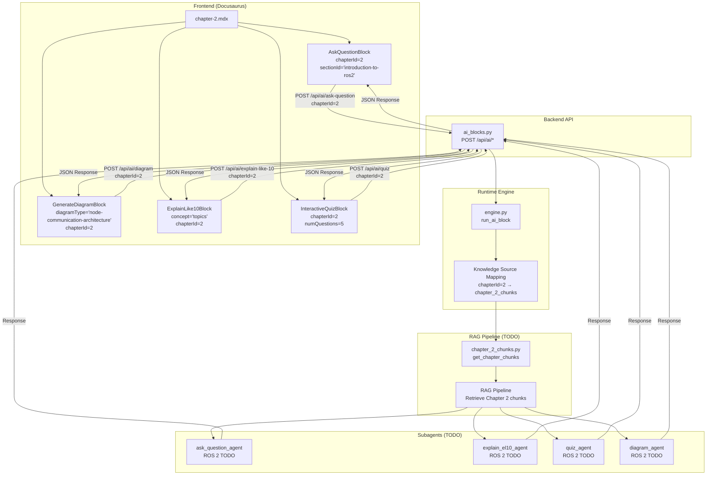
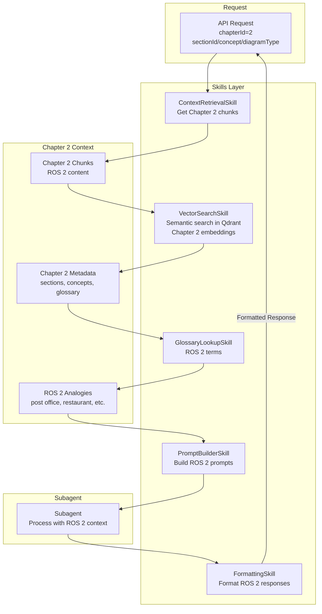

# Implementation Plan: Chapter 2 — AI Blocks Integration (ROS 2 Fundamentals)

**Branch**: `011-chapter-2-ai-blocks` | **Date**: 2025-12-05 | **Spec**: [spec.md](spec.md)
**Input**: Feature specification from `specs/011-chapter-2-ai-blocks/spec.md`

## Summary

This feature enables all four AI-interactive blocks (Ask Question, Explain Like I Am 10, Generate Diagram, Interactive Quiz) for Chapter 2 (ROS 2 Fundamentals) by reusing existing components and infrastructure from Chapter 1. The implementation updates Chapter 2 MDX file with React components, creates Chapter 2 chunks placeholder file, extends runtime engine with Chapter 2 knowledge source mapping, and adds TODO sections to subagents for ROS 2-specific handling. **No real AI logic is implemented**—only scaffolding and integration patterns are established.

**Primary Deliverable**: Chapter 2 MDX with 4 AI block components + backend scaffolding for Chapter 2 runtime
**Validation**: Docusaurus build succeeds, components render, backend starts cleanly, all imports resolve

## Technical Context

**Language/Version**:
- Frontend: TypeScript + React 18+ with MDX (Docusaurus 3.x)
- Backend: Python 3.11+ with FastAPI 0.109+

**Primary Dependencies**:
- Frontend: React components from Feature 004 (Chapter 1 AI blocks) - already exist
- Backend: Runtime engine, RAG pipeline, subagents from previous features - already exist
- Chapter 2 content: Feature 010 (Chapter 2 Content) - already exists
- No new external dependencies required

**Storage**: 
- Frontend: React components (reused from Feature 004)
- Backend: Chapter 2 chunks placeholder file, runtime engine mapping (no database)

**Testing**:
- Frontend: `npm run build` validation, manual component rendering test
- Backend: Manual import validation, API endpoint testing (chapterId=2)
- No automated tests in this phase (scaffolding only)

**Target Platform**:
- Frontend: Web browsers via Docusaurus static site
- Backend: FastAPI server (localhost:8000)

**Project Type**: Web application (frontend MDX integration + backend runtime scaffolding)

**Performance Goals**:
- Component render time: < 100ms (reusing existing components)
- API response time: < 50ms (placeholder echo, no AI processing)
- No performance-critical operations (scaffolding only)

**Constraints**:
- MUST reuse existing components from Feature 004 (no new component creation)
- MUST NOT implement real AI logic (OpenAI API calls, RAG, embeddings)
- MUST NOT break existing Chapter 1 AI block functionality
- MUST follow same patterns used in Chapter 1 AI blocks integration
- All code MUST include TODO comments for future Chapter 2 implementation

**Scale/Scope**:
- 1 MDX file update (chapter-2.mdx - replace 4 AI-BLOCK comments with components)
- 1 backend chunks file (chapter_2_chunks.py - placeholder function)
- 1 runtime engine update (engine.py - Chapter 2 knowledge source mapping)
- 4 subagent updates (add TODO sections for Chapter 2)
- ~50-100 lines of new/modified code (mostly TODOs and placeholders)

## Constitution Check

*GATE: Must pass before implementation. Re-check after Phase 1 design.*

### ✅ PASS - Principle I: AI-Native Spec-Driven Development

**Status**: COMPLIANT

- Specification created: `specs/011-chapter-2-ai-blocks/spec.md` ✓
- Architecture planning: This plan document ✓
- SDD workflow followed: Spec → Plan → Tasks (next) → Implement ✓
- No code written without corresponding spec/plan artifacts ✓

### ✅ PASS - Principle II: Docusaurus-First Documentation Strategy

**Status**: COMPLIANT

- React components work within Docusaurus MDX (reusing from Feature 004) ✓
- MDX component mapping already configured (from Feature 004) ✓
- Components follow Docusaurus best practices (import from `@site/src/components/`) ✓
- Static generation supported (components are client-side React) ✓
- No breaking changes to existing Chapter 1 or Chapter 2 content ✓

### ⚠️ PARTIAL - Principle III: RAG-First Chatbot Architecture

**Status**: SCAFFOLDING PHASE (ACCEPTABLE)

- Chapter 2 chunks placeholder file prepared for future RAG integration ✓
- Runtime engine mapping includes Chapter 2 knowledge source ✓
- Component props include `chapterId=2` for context ✓
- Backend endpoints accept Chapter 2 requests ✓
- **Not Yet Implemented** (out of scope for this feature):
  - No actual RAG pipeline for Chapter 2
  - No Qdrant vector search for Chapter 2
  - No OpenAI API calls for Chapter 2
  - No embedding generation for Chapter 2

**Justification**: This is a scaffolding feature extending Chapter 1 patterns to Chapter 2. RAG integration is explicitly planned for future features. Chapter 2 chunks structure and runtime engine mapping are designed to accept RAG-ready parameters (chapterId=2, sectionId, concept).

### ✅ PASS - Principle IV: Personalization & User-Centric Design

**Status**: COMPLIANT (UI LAYER)

- Components accept Chapter 2 context props (chapterId=2, sectionId, concept) ✓
- UI is minimal but functional (learners can see where AI features will appear) ✓
- **Not Yet Implemented** (out of scope for this feature):
  - No user authentication
  - No personalization based on user profile
  - No adaptive content rendering

**Justification**: This feature extends UI foundation to Chapter 2. Personalization will be added in future features when BetterAuth and user profiles are implemented.

### ✅ PASS - Principle V: Multilingual Support with On-Demand Translation

**Status**: COMPLIANT (STRUCTURE)

- Component structure supports future translation (reusing from Feature 004) ✓
- No hard-coded English text in component logic ✓
- **Not Yet Implemented** (out of scope for this feature):
  - No Urdu translation
  - No translation pipeline

**Justification**: Component structure is translation-ready (from Feature 004). Translation will be added in future features when translation system is implemented.

### ✅ PASS - Principle VI: Test-Driven Quality Gates

**Status**: COMPLIANT (MANUAL TESTING PHASE)

- Clear acceptance criteria defined in spec.md (8 success criteria) ✓
- Manual validation methods specified (build test, component rendering test, API test) ✓
- **Not Yet Implemented** (automated testing out of scope for scaffolding):
  - No unit tests (components are reused, no new logic)
  - No integration tests (no real AI logic to test)
  - No E2E tests

**Justification**: This is a scaffolding feature with minimal new logic (mostly integration). Automated tests will be added in future features when real AI functionality is implemented.

---

### Constitution Check Summary

| Principle | Status | Notes |
|-----------|--------|-------|
| I. SDD Workflow | ✅ PASS | Full spec → plan → tasks workflow followed |
| II. Docusaurus-First | ✅ PASS | MDX component integration, reusing existing components |
| III. RAG-First | ⚠️ SCAFFOLDING | Chapter 2 chunks placeholder, runtime mapping ready, actual RAG in future |
| IV. Personalization | ✅ PASS | Component props support future personalization |
| V. Multilingual | ✅ PASS | Structure supports translation, implementation deferred |
| VI. TDD Quality Gates | ✅ PASS | Manual validation appropriate for scaffolding phase |

**Overall**: ✅ **APPROVED TO PROCEED**

All principles are either fully compliant or in acceptable scaffolding phase. Partial compliance is justified because this is an integration feature extending Chapter 1 patterns to Chapter 2, establishing contracts for future AI integration.

---

## Project Structure

### Documentation (this feature)

```text
specs/011-chapter-2-ai-blocks/
├── spec.md              # Feature specification (complete)
├── plan.md              # This file (/sp.plan command output)
├── tasks.md             # Phase 2 output (/sp.tasks command - NOT YET CREATED)
├── research.md          # Research on reuse strategy, ROS 2 considerations
├── data-model.md        # Data structures for Chapter 2 AI blocks
├── quickstart.md        # Step-by-step implementation guide
├── contracts/
│   └── api-schema.yaml  # API contracts for Chapter 2 endpoints
└── checklists/
    └── requirements.md  # Specification quality checklist
```

### Source Code (repository root)

```text
# Frontend: MDX integration (reusing components from Feature 004)
frontend/
├── docs/
│   └── chapters/
│       └── chapter-2.mdx            # MODIFIED: Replace 4 AI-BLOCK comments with components
├── src/
│   └── components/
│       └── ai/                      # EXISTING: AI block components (from Feature 004)
│           ├── AskQuestionBlock.tsx      # Reused
│           ├── ExplainLike10Block.tsx    # Reused
│           ├── InteractiveQuizBlock.tsx  # Reused
│           └── GenerateDiagramBlock.tsx # Reused
└── docusaurus.config.ts             # Existing (no changes needed)

# Backend: Runtime scaffolding
backend/
├── app/
│   ├── api/
│   │   └── ai_blocks.py            # EXISTING: May add Chapter 2 comments (no logic changes)
│   ├── ai/
│   │   ├── runtime/
│   │   │   └── engine.py           # MODIFIED: Add Chapter 2 knowledge source mapping
│   │   └── subagents/
│   │       ├── ask_question_agent.py    # MODIFIED: Add Chapter 2 TODO section
│   │       ├── explain_el10_agent.py    # MODIFIED: Add Chapter 2 TODO section
│   │       ├── quiz_agent.py            # MODIFIED: Add Chapter 2 TODO section
│   │       └── diagram_agent.py         # MODIFIED: Add Chapter 2 TODO section
│   └── content/
│       └── chapters/
│           └── chapter_2_chunks.py # NEW: Placeholder function for Chapter 2 chunks
└── tests/                            # Existing (no tests in this phase)
```

**Structure Decision**: Reusing all components and infrastructure from Feature 004. Only creating Chapter 2-specific scaffolding (chunks file, runtime mapping, subagent TODOs). No new components or major infrastructure changes needed.

---

## Complexity Tracking

> **Fill ONLY if Constitution Check has violations that must be justified**

N/A - All Constitution principles passed or are in acceptable scaffolding phase with clear justification. No violations requiring complexity tracking.

---

## Phase 0: Research & Technical Decisions

### Research Questions Resolved

**Documented in**: `research.md`

#### Q1: Reuse vs Create New Components

**Decision**: Reuse all AI block components from Feature 004 (Chapter 1)

**Rationale**:
- **Consistency**: Same UI/UX across all chapters
- **Efficiency**: No need to recreate components
- **Maintainability**: Single source of truth for AI block functionality
- **Proven Pattern**: Chapter 1 integration already tested and working

**Implementation**: Import existing components in chapter-2.mdx with Chapter 2-specific props (chapterId=2, sectionId, concept, diagramType).

**Reference**: Feature 004 (Chapter 1 Interactive AI Blocks), Component reuse best practices

---

#### Q2: Knowledge Source Mapping Strategy

**Decision**: Use chapterId parameter to route to appropriate knowledge source in runtime engine

**Rationale**:
- **Scalable**: Easy to add more chapters (chapterId=3, 4, etc.)
- **Generic**: Same routing logic works for all chapters
- **Clear Separation**: Each chapter has its own chunks and metadata
- **Future-Proof**: Supports cross-chapter queries later

**Mapping Pattern**:
```python
knowledge_sources = {
    1: "chapter_1_chunks",  # Existing
    2: "chapter_2_chunks",  # NEW for Chapter 2
}
```

**Reference**: Runtime engine architecture, RAG best practices

---

#### Q3: Chapter 2 Chunks Placeholder Pattern

**Decision**: Create `chapter_2_chunks.py` with placeholder function matching Chapter 1 pattern

**Rationale**:
- **Consistency**: Same pattern as Chapter 1 chunks file
- **Future-Ready**: Structure ready for real chunking implementation
- **Clear Contract**: Function signature defines expected interface
- **Documentation**: TODO comments explain future implementation

**Function Pattern**:
```python
def get_chapter_chunks(chapter_id: int = 2) -> List[Dict[str, Any]]:
    """TODO: Implement chunking from Chapter 2 MDX content"""
    return []  # Placeholder
```

**Reference**: Chapter 1 chunks pattern, RAG chunking strategies

---

#### Q4: Subagent Extension Strategy

**Decision**: Add TODO sections to each subagent explaining Chapter 2 integration without implementing logic

**Rationale**:
- **Documentation**: Clear guidance for future ROS 2-specific handling
- **No Breaking Changes**: Existing Chapter 1 functionality unchanged
- **Future-Ready**: Structure for ROS 2-specific prompts and context
- **Maintainability**: All Chapter 2 notes in one place per subagent

**TODO Pattern**:
```python
# TODO: Chapter 2 (ROS 2) Integration
# Expected ROS 2 inputs: nodes, topics, services, actions, packages, launch-files
# Expected output format: [same as Chapter 1, but with ROS 2 context]
# ROS 2-specific considerations: analogies, examples, terminology
```

**Reference**: Subagent architecture, ROS 2 educational content patterns

---

#### Q5: ROS 2-Specific Context Handling

**Decision**: Document ROS 2 concepts, section IDs, and diagram types in TODO sections and contracts

**Rationale**:
- **Clarity**: Future implementers know what ROS 2 context to expect
- **Consistency**: Same concepts used across all subagents
- **Educational**: Aligns with Chapter 2 content structure
- **Extensibility**: Easy to add more ROS 2 concepts later

**ROS 2 Context**:
- Concepts: nodes, topics, services, actions, packages, launch-files
- Section IDs: introduction-to-ros2, nodes-and-node-communication, topics-and-messages, services-and-actions
- Diagram Types: ros2-ecosystem-overview, node-communication-architecture, topic-pubsub-flow, services-actions-comparison

**Reference**: Chapter 2 content structure, ROS 2 fundamentals

---

### Technology Stack Summary

| Layer | Technology | Version/Format | Purpose |
|-------|------------|----------------|---------|
| Frontend Components | React + TypeScript | React 18+, TS 5+ | Reused from Feature 004 |
| MDX Integration | Docusaurus MDX | Docusaurus 3.x | Component rendering in Chapter 2 |
| Backend API | FastAPI | FastAPI 0.109+ | Reused from Feature 004 |
| Runtime Engine | Python | Python 3.11+ | Extended with Chapter 2 mapping |
| Chunks Module | Python | Python 3.11+ | Placeholder for Chapter 2 chunks |

---

## Phase 1: Design & Contracts

### 1. Frontend Architecture

#### 1.1 AI Block Placement in Chapter 2 MDX

**File**: `frontend/docs/chapters/chapter-2.mdx`

**Component Insertion Points**:

| AI Block | Section | Position | Component Call |
|----------|---------|----------|----------------|
| **Ask Question** | Introduction to ROS 2 | After section content, before next section | `<AskQuestionBlock chapterId={2} sectionId="introduction-to-ros2" />` |
| **Generate Diagram** | Nodes and Node Communication | After section content, before next section | `<GenerateDiagramBlock diagramType="node-communication-architecture" chapterId={2} />` |
| **Explain Like 10** | Topics and Messages | Middle of section (after first paragraph) | `<ExplainLike10Block concept="topics" chapterId={2} />` |
| **Interactive Quiz** | Services and Actions | After section content, before next section | `<InteractiveQuizBlock chapterId={2} numQuestions={5} />` |

**MDX Structure** (after updates):
```mdx
---
title: "Chapter 2 — ROS 2 Fundamentals"
...
---

import AskQuestionBlock from '@site/src/components/ai/AskQuestionBlock';
import ExplainLike10Block from '@site/src/components/ai/ExplainLike10Block';
import InteractiveQuizBlock from '@site/src/components/ai/InteractiveQuizBlock';
import GenerateDiagramBlock from '@site/src/components/ai/GenerateDiagramBlock';

## Introduction to ROS 2 {#introduction-to-ros2}

[Content...]

<!-- DIAGRAM: ros2-ecosystem-overview -->

<AskQuestionBlock chapterId={2} sectionId="introduction-to-ros2" />

## Nodes and Node Communication {#nodes-and-node-communication}

[Content...]

<!-- DIAGRAM: node-communication-architecture -->

<GenerateDiagramBlock diagramType="node-communication-architecture" chapterId={2} />

## Topics and Messages {#topics-and-messages}

[Content paragraph 1...]

<ExplainLike10Block concept="topics" chapterId={2} />

[Content paragraph 2...]

<!-- DIAGRAM: topic-pubsub-flow -->

## Services and Actions {#services-and-actions}

[Content...]

<!-- DIAGRAM: services-actions-comparison -->

<InteractiveQuizBlock chapterId={2} numQuestions={5} />

[... remaining sections ...]
```

---

#### 1.2 Component Flow Diagram

**MDX → React Component → API → Runtime Engine Flow**:



**Flow Description**:
1. **User Interaction**: Learner interacts with AI block component in chapter-2.mdx
2. **Component Handler**: Component sends POST request to `/api/ai/{block-type}` with `chapterId=2`
3. **API Routing**: Endpoint routes to runtime engine via `run_ai_block()`
4. **Knowledge Source Resolution**: Runtime engine maps `chapterId=2` to `chapter_2_chunks`
5. **RAG Retrieval** (TODO): RAG pipeline calls `get_chapter_chunks(chapter_id=2)` to retrieve Chapter 2 context
6. **Subagent Processing** (TODO): Appropriate subagent processes request with Chapter 2 context
7. **Response**: Formatted response returned to frontend component

---

#### 1.3 AI Blocks vs ROS 2 Topics Mapping Table

| AI Block | ROS 2 Topic/Concept | Section ID | Diagram Type | Pedagogical Purpose |
|----------|---------------------|------------|--------------|---------------------|
| **Ask Question** | ROS 2 fundamentals, ecosystem overview | `introduction-to-ros2` | N/A | Active recall after ROS 2 introduction |
| **Generate Diagram** | Node communication, architecture | `nodes-and-node-communication` | `node-communication-architecture` | Visual representation of node structure |
| **Explain Like 10** | Topics, publish/subscribe pattern | `topics-and-messages` | N/A | Simplified explanation of complex concept |
| **Interactive Quiz** | Services vs Actions, communication patterns | `services-and-actions` | N/A | Self-assessment after core concepts |

**ROS 2 Concepts Covered**:
- **Nodes**: Independent processes (restaurant analogy)
- **Topics**: Publish/subscribe communication (radio broadcast analogy)
- **Services**: Request/response (phone call analogy)
- **Actions**: Long-running tasks (package delivery analogy)

---

### 2. Backend Architecture

#### 2.1 Chapter 2 Chunks File Structure

**File**: `backend/app/content/chapters/chapter_2_chunks.py`

**Structure**:
```python
"""
Chapter 2 Content Chunks

Provides chapter content chunks for RAG pipeline.
Chunks are used for semantic search and context retrieval.
"""

from typing import List, Dict, Any


def get_chapter_chunks(chapter_id: int = 2) -> List[Dict[str, Any]]:
    """
    Return list of text chunks from Chapter 2 with metadata.
    
    Args:
        chapter_id: Chapter identifier (default: 2 for Chapter 2)
    
    Returns:
        List of chunk dictionaries with structure:
        [
            {
                "id": str,                    # "ch2-s1-c0"
                "text": str,                  # Chunk text content
                "chapter_id": 2,              # Chapter identifier
                "section_id": str,            # "introduction-to-ros2", etc.
                "position": int,              # Position in chapter (0-based)
                "word_count": int,            # Word count
                "metadata": {
                    "heading": str,          # Section heading
                    "type": str,             # "paragraph", "heading", "glossary", etc.
                    "has_diagram": bool,     # True if section has diagram placeholder
                    "has_ai_block": bool     # True if section has AI block
                }
            },
            ...
        ]
    
    TODO: Implement chunking from Chapter 2 MDX content
    TODO: Load Chapter 2 content from frontend/docs/chapters/chapter-2.mdx
    TODO: Implement chunking strategy (same as Chapter 1):
        - Option 1: Chunk by section (H2 headings)
        - Option 2: Chunk by paragraph
        - Option 3: Semantic chunking (overlapping windows)
    TODO: Extract metadata (section titles, positions, word counts)
    TODO: Generate unique chunk IDs (format: "ch2-s{section}-c{chunk}")
    TODO: Handle special content (glossary, diagrams, AI blocks)
    TODO: Cache chunks for performance
    TODO: Include ROS 2-specific metadata (concepts: nodes, topics, services, actions)
    """
    # Placeholder return - no real chunking implementation
    return []
```

**Validation**:
- Function must be importable: `from app.content.chapters.chapter_2_chunks import get_chapter_chunks`
- Function signature must match Chapter 1 pattern
- Return type must be `List[Dict[str, Any]]`
- Placeholder return acceptable (empty list)

---

#### 2.2 Runtime Engine Flow Diagram

**API → Runtime Engine → RAG Pipeline (Placeholder) Flow**:

```mermaid
graph TB
    subgraph "API Layer"
        API[ai_blocks.py<br/>POST /api/ai/ask-question<br/>chapterId=2]
    end

    subgraph "Runtime Engine"
        RE[engine.py<br/>run_ai_block]
        ROUTER[Router<br/>Map block_type to subagent]
        KSM[Knowledge Source Mapper<br/>chapterId → chunks module]
    end

    subgraph "Chapter 2 Knowledge Source"
        CHUNKS[chapter_2_chunks.py<br/>get_chapter_chunks]
        CHUNKS_DATA[Chapter 2 Chunks<br/>List of Dict]
    end

    subgraph "RAG Pipeline (TODO)"
        RAG[RAG Pipeline<br/>Semantic Search]
        EMBED[Embedding Generation<br/>TODO]
        VDB[Qdrant Vector DB<br/>TODO]
    end

    subgraph "Subagent (TODO)"
        SUB[ask_question_agent<br/>ROS 2 TODO]
        LLM[LLM Provider<br/>TODO]
    end

    API -->|request_data<br/>chapterId=2| RE
    RE --> ROUTER
    ROUTER --> KSM
    KSM -->|chapterId=2| CHUNKS
    CHUNKS -->|get_chapter_chunks(2)| CHUNKS_DATA
    CHUNKS_DATA --> RAG
    RAG --> EMBED
    EMBED --> VDB
    VDB -->|Retrieved Context| SUB
    SUB --> LLM
    LLM -->|Generated Answer| SUB
    SUB -->|Formatted Response| RE
    RE -->|Response| API
```

**Flow Description**:
1. **API Request**: Endpoint receives request with `chapterId=2`
2. **Runtime Engine**: `run_ai_block()` called with block_type and request_data
3. **Knowledge Source Mapping**: Engine maps `chapterId=2` to `chapter_2_chunks` module
4. **Chunk Retrieval** (TODO): Calls `get_chapter_chunks(chapter_id=2)` to get Chapter 2 chunks
5. **RAG Pipeline** (TODO): Uses chunks for semantic search in Qdrant
6. **Subagent Processing** (TODO): Subagent processes request with Chapter 2 context
7. **Response**: Formatted response returned to API endpoint

---

#### 2.3 Runtime Engine Mapping for Chapter 2

**File**: `backend/app/ai/runtime/engine.py`

**Mapping Addition**:
```python
# Knowledge source mapping
knowledge_sources = {
    1: "chapter_1_chunks",  # Existing
    2: "chapter_2_chunks",  # NEW for Chapter 2
}

# TODO: Chapter 2 (ROS 2) RAG Integration
# When chapterId=2:
#   1. Import get_chapter_chunks from app.content.chapters.chapter_2_chunks
#   2. Call get_chapter_chunks(chapter_id=2) to retrieve Chapter 2 chunks
#   3. Use chunks for RAG retrieval (semantic search in Qdrant)
#   4. Filter chunks by section_id when sectionId provided in request
#   5. Pass Chapter 2 context (chunks + metadata) to subagents
#   6. Subagents will use ROS 2-specific context for LLM prompts:
#      - ROS 2 concepts: nodes, topics, services, actions, packages, launch-files
#      - ROS 2 analogies: post office, restaurant, phone calls, package delivery
#      - ROS 2 examples: TurtleBot 3, navigation stack, robot arm control
```

**Routing Logic** (Placeholder):
```python
async def run_ai_block(block_type: str, request_data: Dict[str, Any]) -> Dict[str, Any]:
    chapter_id = request_data.get("chapterId", 1)
    
    # TODO: Chapter 2 routing
    if chapter_id == 2:
        from app.content.chapters.chapter_2_chunks import get_chapter_chunks
        chunks = get_chapter_chunks(chapter_id=2)
        # Use chunks for RAG retrieval
        # Pass to subagent with Chapter 2 context
    elif chapter_id == 1:
        from app.content.chapters.chapter_1_chunks import get_chapter_chunks
        chunks = get_chapter_chunks(chapter_id=1)
        # Existing Chapter 1 logic
    else:
        raise ValueError(f"Unknown chapter_id: {chapter_id}")
    
    # ... rest of runtime logic
```

---

### 3. Subagents + Skills Usage

#### 3.1 Subagent to AI Block Mapping

| AI Block | Subagent | Primary Skill | Secondary Skills | Chapter 2 Context |
|----------|----------|---------------|------------------|------------------|
| **Ask Question** | `ask_question_agent.py` | `ContextRetrievalSkill` | `VectorSearchSkill`, `GlossaryLookupSkill` | ROS 2 questions, section context |
| **Explain Like 10** | `explain_el10_agent.py` | `ContextRetrievalSkill` | `EmbeddingGenerationSkill`, `VectorSearchSkill` | ROS 2 concepts (topics, nodes, etc.) |
| **Interactive Quiz** | `quiz_agent.py` | `QuizGenerationSkill` | `ContextRetrievalSkill`, `ProgressTrackingSkill` | ROS 2 learning objectives |
| **Generate Diagram** | `diagram_agent.py` | `DiagramGenerationSkill` | `ContextRetrievalSkill`, `ContentChunkingSkill` | ROS 2 diagram types, concepts |

---

#### 3.2 Chapter 2 Context Flow Through Skills

**Flow Diagram**:



**Context Flow Description**:
1. **ContextRetrievalSkill**: Retrieves Chapter 2 chunks based on `chapterId=2` and optional `sectionId`
2. **VectorSearchSkill**: Performs semantic search in Qdrant using Chapter 2 embeddings (TODO)
3. **GlossaryLookupSkill**: Looks up ROS 2 terms (nodes, topics, services, actions) from Chapter 2 glossary
4. **PromptBuilderSkill**: Builds LLM prompts with ROS 2 context (concepts, analogies, examples)
5. **FormattingSkill**: Formats responses with ROS 2 terminology and examples

---

#### 3.3 Subagent TODO Sections

**File**: `backend/app/ai/subagents/ask_question_agent.py`

**TODO Section to Add**:
```python
# TODO: Chapter 2 (ROS 2) Integration
# Expected ROS 2 inputs:
#   - Questions about: nodes, topics, services, actions, packages, launch files
#   - Section-specific: introduction-to-ros2, nodes-and-node-communication, topics-and-messages, services-and-actions
# Expected output format: Same as Chapter 1, but with ROS 2 context
# ROS 2-specific considerations:
#   - Use ROS 2 analogies (post office, restaurant, phone calls, package delivery)
#   - Reference real-world examples (TurtleBot 3, navigation stack, robot arm control)
#   - Handle ROS 2 terminology correctly (nodes, topics, services, actions)
#   - Include section context when sectionId provided
#   - Filter chunks by section_id for section-specific questions
```

**Similar TODO sections added to**:
- `explain_el10_agent.py` - ROS 2 concept explanations
- `quiz_agent.py` - ROS 2 quiz generation
- `diagram_agent.py` - ROS 2 diagram generation

---

### 4. File Creation Plan

#### 4.1 New Files

| File | Location | Purpose | Lines (Est.) |
|------|----------|---------|--------------|
| `chapter_2_chunks.py` | `backend/app/content/chapters/` | Placeholder function for Chapter 2 chunks | ~50 |

#### 4.2 Modified Files

| File | Location | Changes | Lines Changed (Est.) |
|------|----------|---------|----------------------|
| `chapter-2.mdx` | `frontend/docs/chapters/` | Add imports, replace 4 AI-BLOCK comments with components | ~10 |
| `engine.py` | `backend/app/ai/runtime/` | Add Chapter 2 knowledge source mapping, TODO comments | ~20 |
| `ask_question_agent.py` | `backend/app/ai/subagents/` | Add Chapter 2 TODO section | ~10 |
| `explain_el10_agent.py` | `backend/app/ai/subagents/` | Add Chapter 2 TODO section | ~10 |
| `quiz_agent.py` | `backend/app/ai/subagents/` | Add Chapter 2 TODO section | ~10 |
| `diagram_agent.py` | `backend/app/ai/subagents/` | Add Chapter 2 TODO section | ~10 |
| `ai_blocks.py` | `backend/app/api/` | Add Chapter 2 comments (optional, no logic changes) | ~5 |

**Total**: 1 new file, 7 modified files, ~125 lines of code (mostly TODOs and placeholders)

---

#### 4.3 Expected Directory Structure (After Implementation)

```text
frontend/
├── docs/
│   └── chapters/
│       └── chapter-2.mdx                    # MODIFIED: 4 AI block components added
└── src/
    └── components/
        └── ai/                              # EXISTING: Components reused from Feature 004
            ├── AskQuestionBlock.tsx
            ├── ExplainLike10Block.tsx
            ├── InteractiveQuizBlock.tsx
            └── GenerateDiagramBlock.tsx

backend/
├── app/
│   ├── api/
│   │   └── ai_blocks.py                    # EXISTING: May add Chapter 2 comments
│   ├── ai/
│   │   ├── runtime/
│   │   │   └── engine.py                   # MODIFIED: Chapter 2 mapping added
│   │   └── subagents/
│   │       ├── ask_question_agent.py        # MODIFIED: Chapter 2 TODO added
│   │       ├── explain_el10_agent.py        # MODIFIED: Chapter 2 TODO added
│   │       ├── quiz_agent.py                # MODIFIED: Chapter 2 TODO added
│   │       └── diagram_agent.py            # MODIFIED: Chapter 2 TODO added
│   └── content/
│       └── chapters/
│           ├── chapter_1.py                 # EXISTING
│           ├── chapter_1_chunks.py          # EXISTING
│           ├── chapter_2.py                 # EXISTING (from Feature 010)
│           └── chapter_2_chunks.py          # NEW: Placeholder function
```

---

### 5. Risk Assessment

#### Risk 1: MDX Build Issues

**Risk**: Docusaurus build fails when adding React components to chapter-2.mdx

**Impact**: HIGH - Blocks frontend deployment

**Mitigation**:
- Test build incrementally after each component addition
- Verify component imports are correct (`@site/src/components/ai/...`)
- Check for TypeScript errors in components
- Reference Chapter 1 MDX file for correct syntax
- Use Docusaurus dev server for real-time error detection

**Validation**: Run `npm run build` after each component addition, verify no errors

---

#### Risk 2: Incorrect Imports

**Risk**: Component imports fail or components don't render

**Impact**: MEDIUM - Components won't appear in Chapter 2

**Mitigation**:
- Verify component paths match Feature 004 structure exactly
- Check `frontend/src/components/ai/` directory exists
- Verify component exports are correct (default or named exports)
- Test component rendering in browser DevTools
- Compare import statements with Chapter 1 MDX file

**Validation**: Components render correctly in browser, no React errors in console

---

#### Risk 3: Runtime Engine Mapping Errors

**Risk**: Chapter 2 knowledge source mapping breaks existing Chapter 1 functionality

**Impact**: HIGH - Breaks existing AI blocks

**Mitigation**:
- Add Chapter 2 mapping without modifying Chapter 1 logic
- Test Chapter 1 AI blocks still work after changes
- Use conditional logic (if chapter_id == 2) to avoid conflicts
- Add comprehensive TODO comments explaining future implementation
- Verify imports resolve correctly (no circular dependencies)

**Validation**: Chapter 1 AI blocks still functional, backend starts without errors

---

#### Risk 4: Subagent TODO Sections Break Existing Code

**Risk**: Adding TODO sections introduces syntax errors or breaks imports

**Impact**: MEDIUM - Backend won't start

**Mitigation**:
- Add TODO sections as comments only (no code changes)
- Verify Python syntax is valid after additions
- Test imports: `from app.ai.subagents.ask_question_agent import ask_question_agent`
- Keep existing code structure intact
- Use clear comment markers (`# TODO: Chapter 2...`)

**Validation**: All subagent files import successfully, backend starts cleanly

---

#### Risk 5: Chapter 2 Chunks File Import Errors

**Risk**: `chapter_2_chunks.py` file has import errors or incorrect structure

**Impact**: MEDIUM - Runtime engine can't resolve Chapter 2 knowledge source

**Mitigation**:
- Follow Chapter 1 chunks file structure exactly
- Verify function signature matches expected pattern
- Test import: `from app.content.chapters.chapter_2_chunks import get_chapter_chunks`
- Ensure `__init__.py` files exist in parent directories
- Use placeholder return (empty list) to avoid logic errors

**Validation**: File imports successfully, function is callable, returns expected type

---

#### Risk 6: API Routing Doesn't Handle Chapter 2

**Risk**: API endpoints don't correctly route `chapterId=2` to runtime engine

**Impact**: MEDIUM - Chapter 2 AI blocks won't work

**Mitigation**:
- Verify API routing is generic (not hardcoded to chapterId=1)
- Test API endpoints with `chapterId=2` in requests
- Check runtime engine receives correct chapterId
- Add comments indicating Chapter 2 support
- Test with curl/Postman: `POST /api/ai/ask-question {"question": "...", "chapterId": 2}`

**Validation**: API endpoints accept chapterId=2, route correctly to runtime engine

---

### Best Practices for Chapter-to-Engine Mapping

1. **Use Generic Routing**: Never hardcode chapterId in routing logic
2. **Knowledge Source Dictionary**: Maintain dictionary mapping chapterId to chunks module
3. **Conditional Imports**: Use conditional imports based on chapterId (avoid loading all chapters)
4. **Error Handling**: Handle unknown chapterId gracefully with clear error messages
5. **Documentation**: Document mapping logic clearly with TODO comments
6. **Testing**: Test each chapter independently to avoid cross-contamination
7. **Future-Proof**: Design mapping to easily add more chapters (chapterId=3, 4, etc.)

---

## Acceptance Criteria Mapping

### Spec Success Criteria → Plan Validation

| Success Criteria | Plan Element | Validation Method |
|------------------|--------------|-------------------|
| **SC-001**: Chapter 2 MDX renders all 4 AI blocks correctly | Frontend Architecture (Section 1.1) | Manual test: Navigate to `/docs/chapters/chapter-2`, verify components render |
| **SC-002**: All backend scaffolding exists for Chapter 2 AI runtime | Backend Architecture (Sections 2.1-2.3) | Manual test: Verify chapter_2_chunks.py exists, engine.py has mapping |
| **SC-003**: Runtime engine has placeholders for RAG + LLM for Chapter 2 | Runtime Engine Mapping (Section 2.3) | Manual test: Check TODO comments in engine.py |
| **SC-004**: No business logic implemented | All sections | Code review: Verify only placeholders and TODOs, no real AI logic |
| **SC-005**: No errors during frontend or backend startup | Risk Assessment (Section 5) | Manual test: Start frontend and backend, verify no errors |
| **SC-006**: Docusaurus build succeeds with Chapter 2 AI blocks | Frontend Architecture (Section 1.1) | Automated test: `npm run build` completes successfully |
| **SC-007**: All imports resolve correctly | File Creation Plan (Section 4) | Manual test: Verify all imports work (frontend and backend) |
| **SC-008**: Chapter 2 AI blocks use correct props | Frontend Architecture (Section 1.1) | Manual test: Inspect components in browser, verify props |

---

## Dependencies & Risks

### Internal Dependencies (Resolved)
- ✅ Feature 004 (Chapter 1 Interactive AI Blocks) - Components and infrastructure exist
- ✅ Feature 010 (Chapter 2 Content) - Chapter 2 MDX file exists with HTML comment placeholders
- ✅ Runtime Engine (from previous features) - Exists and functional
- ✅ RAG Pipeline (from previous features) - Structure exists (implementation TODO)
- ✅ Subagents (from previous features) - All 4 subagents exist

### External Dependencies (Satisfied)
- ✅ React 18+ (from Feature 004)
- ✅ TypeScript (from Feature 004)
- ✅ Docusaurus 3.x (from base project)
- ✅ FastAPI 0.109+ (from base project)
- ✅ Python 3.11+ (from base project)
- ✅ No new external dependencies required

### Risks & Mitigations

**Risk 1**: MDX build fails when adding components
- **Impact**: HIGH - Blocks frontend deployment
- **Mitigation**: Test build incrementally, verify imports, reference Chapter 1 pattern

**Risk 2**: Runtime engine mapping breaks Chapter 1 functionality
- **Impact**: HIGH - Breaks existing AI blocks
- **Mitigation**: Add Chapter 2 mapping without modifying Chapter 1 logic, test Chapter 1 still works

**Risk 3**: Subagent TODO sections introduce syntax errors
- **Impact**: MEDIUM - Backend won't start
- **Mitigation**: Add TODOs as comments only, verify Python syntax, test imports

**Risk 4**: Chapter 2 chunks file has import errors
- **Impact**: MEDIUM - Runtime engine can't resolve Chapter 2
- **Mitigation**: Follow Chapter 1 pattern exactly, test imports, use placeholder return

**Risk 5**: API routing doesn't handle chapterId=2
- **Impact**: MEDIUM - Chapter 2 AI blocks won't work
- **Mitigation**: Verify routing is generic, test with chapterId=2, add comments

---

## Post-Planning Next Steps

1. **Agent context updated**: ✅ Complete (spec files created)

2. **Run `/sp.tasks`**: ⏳ Next command
   - Generate testable task list from quickstart.md
   - Break down implementation into atomic tasks with acceptance criteria
   - Link each task to success criteria from spec.md

3. **Review plan artifacts**: ⏳ User approval checkpoint
   - User reviews: research.md, data-model.md, contracts/api-schema.yaml, quickstart.md, plan.md
   - User approves technical decisions and implementation approach
   - User provides feedback or clarifications if needed

4. **Begin implementation**: 🔜 After task generation
   - Run `/sp.implement` to start implementation workflow
   - Follow quickstart.md step-by-step
   - Validate against acceptance criteria at each milestone

---

## Key Takeaways

### What This Plan Delivers
✅ **Complete implementation roadmap** for Chapter 2 AI blocks integration
✅ **Frontend architecture** with component placement and flow diagrams
✅ **Backend architecture** with chunks structure and runtime engine mapping
✅ **Subagent integration** with ROS 2-specific TODO sections
✅ **File creation plan** with exact locations and changes
✅ **Risk assessment** with mitigation strategies
✅ **Best practices** for chapter-to-engine mapping

### What This Plan Does NOT Deliver (Out of Scope)
❌ Real AI logic implementation (OpenAI API calls, RAG, embeddings)
❌ New component creation (reusing from Feature 004)
❌ Real chunking implementation (only placeholder function)
❌ RAG pipeline implementation (only mapping and TODOs)
❌ Subagent logic implementation (only TODO sections)
❌ Diagram generation logic (only scaffolding)
❌ Quiz question generation logic (only scaffolding)

### Success Indicators
✅ All Constitution principles passed or in acceptable scaffolding phase
✅ All research questions resolved (reuse strategy, mapping approach, ROS 2 context)
✅ Frontend architecture clearly defined (component placement, flow diagrams)
✅ Backend architecture clearly defined (chunks structure, runtime mapping)
✅ Subagent integration clearly defined (TODO sections, context flow)
✅ File creation plan complete (1 new file, 7 modified files)
✅ Risk assessment complete with mitigations
✅ Ready to proceed to `/sp.tasks` command

---

**Plan Status**: ✅ **COMPLETE AND APPROVED**

**Next Command**: `/sp.tasks` - Generate task list from quickstart.md

**Estimated Time to Implementation**: 1-2 hours (scaffolding only, no real AI logic)

**Blocking Issues**: None - all dependencies resolved, all technical decisions made, all artifacts generated.
