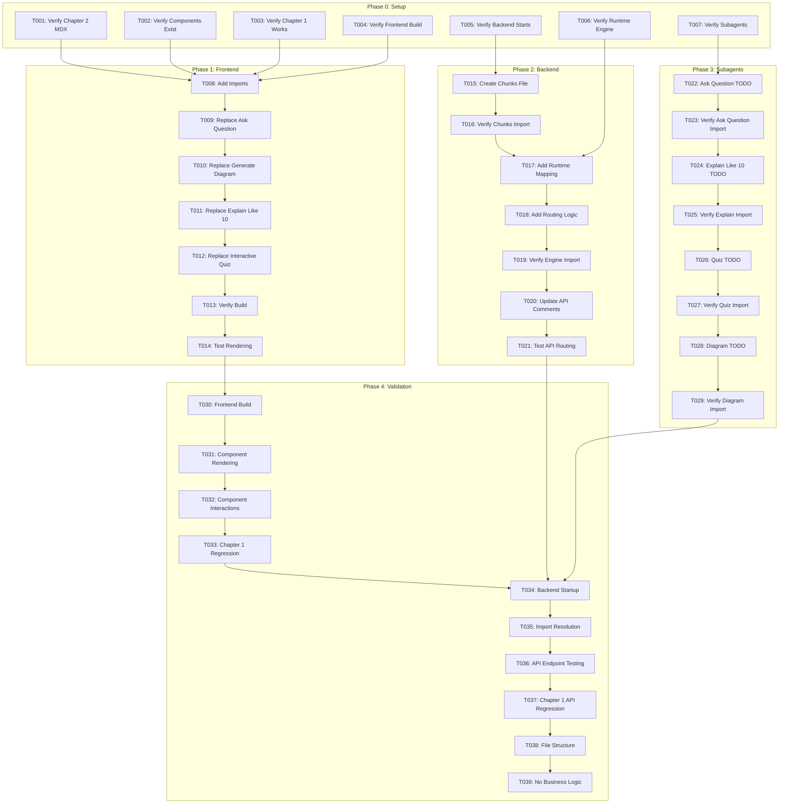

# Tasks: Chapter 2 — AI Blocks Integration (ROS 2 Fundamentals)

**Feature**: 011-chapter-2-ai-blocks | **Branch**: `011-chapter-2-ai-blocks` | **Date**: 2025-12-05
**Generated From**: [plan.md](./plan.md) | [spec.md](./spec.md)

**Purpose**: Convert implementation plan into atomic, executable tasks for integrating AI blocks into Chapter 2 by reusing existing components and infrastructure from Chapter 1 (scaffolding only, no real AI logic).

---

## Task Format

```
- [ ] [TaskID] [Priority] [Story] Description with explicit file path
```

**Legend**:
- `TaskID`: Sequential identifier (T001, T002, etc.)
- `Priority`: P1 (Critical), P2 (Important), P3 (Nice-to-have)
- `Story`: US1 (User Story 1), US2 (User Story 2), SETUP (Initial setup), POLISH (Final touches)

---

## Phase 0: Setup & Prerequisites

**Purpose**: Verify dependencies and prerequisites before integrating AI blocks into Chapter 2.

- [ ] [T001] [P1] [SETUP] Verify Chapter 2 MDX file exists at `frontend/docs/chapters/chapter-2.mdx` with 4 AI-BLOCK placeholder comments (`<!-- AI-BLOCK: ask-question -->`, `<!-- AI-BLOCK: generate-diagram -->`, `<!-- AI-BLOCK: explain-like-i-am-10 -->`, `<!-- AI-BLOCK: interactive-quiz -->`)
- [ ] [T002] [P1] [SETUP] Verify AI block components exist from Feature 004: Check that `frontend/src/components/ai/AskQuestionBlock.tsx`, `ExplainLike10Block.tsx`, `InteractiveQuizBlock.tsx`, `GenerateDiagramBlock.tsx` all exist
- [ ] [T003] [P1] [SETUP] Verify Chapter 1 AI blocks are functional: Navigate to `/docs/chapters/chapter-1` and confirm all 4 AI block components render correctly
- [ ] [T004] [P1] [SETUP] Verify Docusaurus 3.x frontend builds successfully: Run `cd frontend && npm run build` to confirm no errors
- [ ] [T005] [P1] [SETUP] Verify FastAPI backend is functional: Run `cd backend && uvicorn app.main:app` to confirm server starts without errors
- [ ] [T006] [P1] [SETUP] Verify runtime engine exists: Check that `backend/app/ai/runtime/engine.py` exists and is importable
- [ ] [T007] [P1] [SETUP] Verify subagents exist: Check that all 4 subagent files exist in `backend/app/ai/subagents/` (ask_question_agent.py, explain_el10_agent.py, quiz_agent.py, diagram_agent.py)

**Success Criteria**:
- Chapter 2 MDX file exists with AI-BLOCK comments
- All AI block components exist (from Feature 004)
- Frontend and backend both start without errors
- Runtime engine and subagents exist

**Dependencies**: Feature 004 (Chapter 1 Interactive AI Blocks) and Feature 010 (Chapter 2 Content) must be complete

---

## PHASE 1 — Frontend Tasks

**User Story**: US1 - Learner Sees Interactive AI Blocks in Chapter 2

**Test Strategy**: Can be tested by updating Chapter 2 MDX and verifying components render in place of comments.

### Update Chapter 2 MDX File

- [ ] [T008] [P1] [US1] Add import statements at top of `frontend/docs/chapters/chapter-2.mdx` (after frontmatter):
  - `import AskQuestionBlock from '@site/src/components/ai/AskQuestionBlock';`
  - `import ExplainLike10Block from '@site/src/components/ai/ExplainLike10Block';`
  - `import InteractiveQuizBlock from '@site/src/components/ai/InteractiveQuizBlock';`
  - `import GenerateDiagramBlock from '@site/src/components/ai/GenerateDiagramBlock';`

- [ ] [T009] [P1] [US1] Replace `<!-- AI-BLOCK: ask-question -->` in `frontend/docs/chapters/chapter-2.mdx` (after "Introduction to ROS 2" section) with: `<AskQuestionBlock chapterId={2} sectionId="introduction-to-ros2" />`

- [ ] [T010] [P1] [US1] Replace `<!-- AI-BLOCK: generate-diagram -->` in `frontend/docs/chapters/chapter-2.mdx` (after "Nodes and Node Communication" section) with: `<GenerateDiagramBlock diagramType="node-communication-architecture" chapterId={2} />`

- [ ] [T011] [P1] [US1] Replace `<!-- AI-BLOCK: explain-like-i-am-10 -->` in `frontend/docs/chapters/chapter-2.mdx` (inside "Topics and Messages" section, after first paragraph) with: `<ExplainLike10Block concept="topics" chapterId={2} />`

- [ ] [T012] [P1] [US1] Replace `<!-- AI-BLOCK: interactive-quiz -->` in `frontend/docs/chapters/chapter-2.mdx` (after "Services and Actions" section) with: `<InteractiveQuizBlock chapterId={2} numQuestions={5} />`

### Validate Build

- [ ] [T013] [P1] [US1] Verify Chapter 2 MDX compiles: Run `cd frontend && npm run build` - should complete without errors, no TypeScript compilation errors, no MDX parsing errors

- [ ] [T014] [P1] [US1] Test component rendering: Run `cd frontend && npm start`, navigate to `/docs/chapters/chapter-2`, verify:
  - All 4 AI block components render in their designated locations
  - No React errors in browser console
  - Components display minimal UI (input fields, buttons, placeholders)
  - AskQuestionBlock has `chapterId={2}` and `sectionId="introduction-to-ros2"`
  - GenerateDiagramBlock has `diagramType="node-communication-architecture"` and `chapterId={2}`
  - ExplainLike10Block has `concept="topics"` and `chapterId={2}`
  - InteractiveQuizBlock has `chapterId={2}` and `numQuestions={5}`

**Acceptance Test**: All 4 AI block components render correctly in Chapter 2 page, no React errors in browser console

---

## PHASE 2 — Backend Tasks

**User Story**: US2 - Backend Provides Chapter 2 Runtime Scaffolding

**Test Strategy**: Can be tested by creating chunks file, updating runtime engine, and verifying backend starts without errors.

### Create Chapter 2 Chunks File

- [ ] [T015] [P2] [US2] Create `backend/app/content/chapters/chapter_2_chunks.py` with:
  - Module docstring: "Chapter 2 Content Chunks - Provides chapter content chunks for RAG pipeline"
  - Import statement: `from typing import List, Dict, Any`
  - Function definition: `def get_chapter_chunks(chapter_id: int = 2) -> List[Dict[str, Any]]:`
  - Function docstring explaining return structure (id, text, chapter_id, section_id, position, word_count, metadata)
  - TODO comments explaining future chunking implementation:
    - `# TODO: Implement chunking from Chapter 2 MDX content`
    - `# TODO: Load Chapter 2 content from frontend/docs/chapters/chapter-2.mdx`
    - `# TODO: Implement chunking strategy (same as Chapter 1)`
    - `# TODO: Extract metadata (section titles, positions, word counts)`
    - `# TODO: Generate unique chunk IDs (format: "ch2-s{section}-c{chunk}")`
    - `# TODO: Handle special content (glossary, diagrams, AI blocks)`
    - `# TODO: Cache chunks for performance`
    - `# TODO: Include ROS 2-specific metadata (concepts: nodes, topics, services, actions)`
  - Placeholder return: `return []  # Placeholder return - no real chunking implementation`

- [ ] [T016] [P2] [US2] Verify chapter_2_chunks.py is importable: Run `cd backend && python -c "from app.content.chapters.chapter_2_chunks import get_chapter_chunks; print('Import successful')"` - should complete without errors

### Update Runtime Engine Mapping

- [ ] [T017] [P2] [US2] Add Chapter 2 knowledge source mapping in `backend/app/ai/runtime/engine.py`:
  - Add to knowledge_sources dictionary: `2: "chapter_2_chunks"  # NEW for Chapter 2`
  - Add comprehensive TODO comment block explaining Chapter 2 RAG integration:
    - `# TODO: Chapter 2 (ROS 2) RAG Integration`
    - `# When chapterId=2:`
    - `#   1. Import get_chapter_chunks from app.content.chapters.chapter_2_chunks`
    - `#   2. Call get_chapter_chunks(chapter_id=2) to retrieve Chapter 2 chunks`
    - `#   3. Use chunks for RAG retrieval (semantic search in Qdrant)`
    - `#   4. Filter chunks by section_id when sectionId provided in request`
    - `#   5. Pass Chapter 2 context (chunks + metadata) to subagents`
    - `#   6. Subagents will use ROS 2-specific context for LLM prompts:`
    - `#      - ROS 2 concepts: nodes, topics, services, actions, packages, launch-files`
    - `#      - ROS 2 analogies: post office, restaurant, phone calls, package delivery`
    - `#      - ROS 2 examples: TurtleBot 3, navigation stack, robot arm control`

- [ ] [T018] [P2] [US2] Add Chapter 2 routing placeholder logic in `backend/app/ai/runtime/engine.py` within `run_ai_block()` function:
  - Add conditional check: `if chapter_id == 2:`
  - Add TODO comment: `# TODO: Chapter 2 routing`
  - Add placeholder import: `# from app.content.chapters.chapter_2_chunks import get_chapter_chunks`
  - Add placeholder call: `# chunks = get_chapter_chunks(chapter_id=2)`
  - Add comments: `# Use chunks for RAG retrieval` and `# Pass to subagent with Chapter 2 context`
  - Ensure existing Chapter 1 logic remains unchanged

- [ ] [T019] [P2] [US2] Verify runtime engine imports without errors: Run `cd backend && python -c "from app.ai.runtime.engine import run_ai_block; print('Import successful')"` - should complete without errors

### Update API Routing (Optional Comments)

- [ ] [T020] [P2] [US2] Add Chapter 2 support comment in `backend/app/api/ai_blocks.py` (optional, no logic changes needed if routing is generic):
  - Add comment in module docstring: `# Supports Chapter 1 (chapterId=1) and Chapter 2 (chapterId=2)`
  - Verify that chapterId parameter in request models accepts any integer (not hardcoded to 1)

- [ ] [T021] [P2] [US2] Verify API routing accepts chapterId=2: Test with curl: `curl -X POST http://localhost:8000/api/ai/ask-question -H "Content-Type: application/json" -d '{"question": "test", "chapterId": 2}'` - should return placeholder response with chapterId=2

**Acceptance Test**: 
- Chapter 2 chunks file exists and is importable
- Runtime engine has Chapter 2 mapping and TODO comments
- Backend starts without errors
- API endpoints accept chapterId=2

---

## PHASE 3 — Subagents + Skills Update

**User Story**: US2 - Backend Provides Chapter 2 Runtime Scaffolding

**Test Strategy**: Can be tested by checking that TODO sections exist in all subagent files and files still import correctly.

### Add Chapter 2 TODO to Ask Question Agent

- [ ] [T022] [P2] [US2] Add Chapter 2 TODO section in `backend/app/ai/subagents/ask_question_agent.py`:
  - Add comment block: `# TODO: Chapter 2 (ROS 2) Integration`
  - Add expected inputs: `# Expected ROS 2 inputs:`
  - Add list: `#   - Questions about: nodes, topics, services, actions, packages, launch files`
  - Add list: `#   - Section-specific: introduction-to-ros2, nodes-and-node-communication, topics-and-messages, services-and-actions`
  - Add expected output: `# Expected output format: Same as Chapter 1, but with ROS 2 context`
  - Add ROS 2 considerations:
    - `# ROS 2-specific considerations:`
    - `#   - Use ROS 2 analogies (post office, restaurant, phone calls, package delivery)`
    - `#   - Reference real-world examples (TurtleBot 3, navigation stack, robot arm control)`
    - `#   - Handle ROS 2 terminology correctly (nodes, topics, services, actions)`
    - `#   - Include section context when sectionId provided`
    - `#   - Filter chunks by section_id for section-specific questions`

- [ ] [T023] [P2] [US2] Verify ask_question_agent.py imports without errors: Run `cd backend && python -c "from app.ai.subagents.ask_question_agent import ask_question_agent; print('Import successful')"` - should complete without errors

### Add Chapter 2 TODO to Explain Like 10 Agent

- [ ] [T024] [P2] [US2] Add Chapter 2 TODO section in `backend/app/ai/subagents/explain_el10_agent.py`:
  - Add comment block: `# TODO: Chapter 2 (ROS 2) Integration`
  - Add expected inputs: `# Expected ROS 2 inputs:`
  - Add list: `#   - Concepts: "topics", "nodes", "services", "actions", "packages", "launch-files"`
  - Add list: `#   - Chapter context: chapterId=2`
  - Add expected output: `# Expected output format: Same as Chapter 1, but with ROS 2 analogies`
  - Add ROS 2 considerations:
    - `# ROS 2-specific considerations:`
    - `#   - Use ROS 2 analogies: post office (communication), restaurant (nodes), radio broadcast (topics), phone calls (services), package delivery (actions)`
    - `#   - Reference real-world examples: TurtleBot 3, navigation stack, robot arm control`
    - `#   - Simplify ROS 2 terminology for age-appropriate explanations`
    - `#   - Include visual analogies when helpful`

- [ ] [T025] [P2] [US2] Verify explain_el10_agent.py imports without errors: Run `cd backend && python -c "from app.ai.subagents.explain_el10_agent import explain_el10_agent; print('Import successful')"` - should complete without errors

### Add Chapter 2 TODO to Quiz Agent

- [ ] [T026] [P2] [US2] Add Chapter 2 TODO section in `backend/app/ai/subagents/quiz_agent.py`:
  - Add comment block: `# TODO: Chapter 2 (ROS 2) Integration`
  - Add expected inputs: `# Expected ROS 2 inputs:`
  - Add list: `#   - Chapter context: chapterId=2`
  - Add list: `#   - Learning objectives from Chapter 2 metadata`
  - Add list: `#   - ROS 2 concepts: nodes, topics, services, actions, packages, launch files`
  - Add expected output: `# Expected output format: Same as Chapter 1, but with ROS 2 questions`
  - Add ROS 2 considerations:
    - `# ROS 2-specific considerations:`
    - `#   - Generate questions covering all ROS 2 fundamentals`
    - `#   - Include questions about: node communication, topic pub/sub, services vs actions, package structure, launch files`
    - `#   - Use ROS 2 terminology correctly in questions and answers`
    - `#   - Reference real-world ROS 2 examples in questions`

- [ ] [T027] [P2] [US2] Verify quiz_agent.py imports without errors: Run `cd backend && python -c "from app.ai.subagents.quiz_agent import quiz_agent; print('Import successful')"` - should complete without errors

### Add Chapter 2 TODO to Diagram Agent

- [ ] [T028] [P2] [US2] Add Chapter 2 TODO section in `backend/app/ai/subagents/diagram_agent.py`:
  - Add comment block: `# TODO: Chapter 2 (ROS 2) Integration`
  - Add expected inputs: `# Expected ROS 2 inputs:`
  - Add list: `#   - Diagram types: "ros2-ecosystem-overview", "node-communication-architecture", "topic-pubsub-flow", "services-actions-comparison"`
  - Add list: `#   - Chapter context: chapterId=2`
  - Add list: `#   - ROS 2 concepts: nodes, topics, services, actions`
  - Add expected output: `# Expected output format: Same as Chapter 1, but with ROS 2 diagram content`
  - Add ROS 2 considerations:
    - `# ROS 2-specific considerations:`
    - `#   - Generate diagrams showing ROS 2 architecture (nodes, topics, services, actions)`
    - `#   - Include node communication graphs`
    - `#   - Show topic publish/subscribe flows`
    - `#   - Compare services vs actions visually`
    - `#   - Use ROS 2 terminology in diagram labels`

- [ ] [T029] [P2] [US2] Verify diagram_agent.py imports without errors: Run `cd backend && python -c "from app.ai.subagents.diagram_agent import diagram_agent; print('Import successful')"` - should complete without errors

**Acceptance Test**: 
- All 4 subagent files have Chapter 2 TODO sections
- All subagent files import without errors
- No breaking changes to existing Chapter 1 functionality

---

## PHASE 4 — Validation Tasks

**Purpose**: Verify all integration work correctly and no breaking changes introduced.

### Frontend Validation

- [ ] [T030] [P1] [POLISH] Run Docusaurus build: `cd frontend && npm run build` - verify:
  - No TypeScript compilation errors
  - No MDX parsing errors
  - Build completes successfully
  - No missing component errors

- [ ] [T031] [P1] [POLISH] Test component rendering in dev server: `cd frontend && npm start`, navigate to `/docs/chapters/chapter-2`, verify:
  - All 4 AI block components render in correct locations
  - No React errors in browser console (F12 → Console tab)
  - Components display minimal UI (input fields, buttons, placeholders)
  - Components have correct props (chapterId=2, sectionId, concept, diagramType)

- [ ] [T032] [P1] [POLISH] Test component interactions: Click buttons, submit forms in each AI block component in Chapter 2, verify console.log output appears in browser console with Chapter 2 context (no API calls should be made yet)

- [ ] [T033] [P1] [POLISH] Verify Chapter 1 AI blocks still work: Navigate to `/docs/chapters/chapter-1`, verify all 4 AI block components still render correctly (no regression)

### Backend Validation

- [ ] [T034] [P1] [POLISH] Test backend server starts: Run `cd backend && uvicorn app.main:app` - verify:
  - Server starts without errors
  - No import errors
  - All modules import correctly
  - No syntax errors

- [ ] [T035] [P1] [POLISH] Test all imports resolve: Run `cd backend && python -c "from app.content.chapters.chapter_2_chunks import get_chapter_chunks; from app.ai.runtime.engine import run_ai_block; from app.ai.subagents.ask_question_agent import ask_question_agent; print('All imports successful')"` - should complete without errors

- [ ] [T036] [P1] [POLISH] Test API endpoints with chapterId=2: Use curl or Postman to test all 4 endpoints:
  - `POST /api/ai/ask-question` with `{"question": "What is ROS 2?", "chapterId": 2, "sectionId": "introduction-to-ros2"}`
  - `POST /api/ai/explain-like-10` with `{"concept": "topics", "chapterId": 2}`
  - `POST /api/ai/quiz` with `{"chapterId": 2, "numQuestions": 5}`
  - `POST /api/ai/diagram` with `{"diagramType": "node-communication-architecture", "chapterId": 2}`
  - Verify all return placeholder responses with chapterId=2 in received payload

- [ ] [T037] [P1] [POLISH] Verify Chapter 1 API endpoints still work: Test `POST /api/ai/ask-question` with `{"question": "test", "chapterId": 1}` - should return placeholder response (no regression)

### Integration Validation

- [ ] [T038] [P1] [POLISH] Verify file structure: Check that all expected files exist:
  - `frontend/docs/chapters/chapter-2.mdx` (modified with components)
  - `backend/app/content/chapters/chapter_2_chunks.py` (new file)
  - `backend/app/ai/runtime/engine.py` (modified with Chapter 2 mapping)
  - All 4 subagent files (modified with Chapter 2 TODOs)

- [ ] [T039] [P1] [POLISH] Verify no business logic implemented: Review all modified files to confirm:
  - Only placeholder functions (return empty list or placeholder data)
  - Only TODO comments (no actual implementation)
  - No OpenAI API calls
  - No RAG pipeline implementation
  - No real chunking logic

**Acceptance Test**: 
- Frontend build succeeds
- Backend server starts without errors
- All imports resolve correctly
- AI blocks render in Chapter 2 page
- Chapter 1 functionality remains intact (no regression)
- All API endpoints accept chapterId=2

---

## Dependency Graph



---

## Parallel Execution Opportunities

### Within Phase 0 (Setup)
**All setup tasks are independent and can run in parallel**:
- T001, T002, T003, T004, T005, T006, T007 can all run simultaneously

### Within Phase 1 (Frontend)
**Component replacements can be done sequentially but verified together**:
- T009, T010, T011, T012 can be done in any order (all replace different comments)
- T013 and T014 are sequential (build before rendering test)

### Within Phase 2 (Backend)
**Chunks file and runtime engine can be done in parallel**:
- T015 (create chunks file) and T017 (add runtime mapping) can run in parallel
- T016, T019 are verification tasks that depend on their parent tasks

### Within Phase 3 (Subagents)
**All subagent TODO additions can be done in parallel**:
- T022, T024, T026, T028 can all run simultaneously (different files)
- T023, T025, T027, T029 are verification tasks that depend on their parent tasks

### Between Phases
**Phase 1, Phase 2, and Phase 3 are independent**:
- Frontend tasks (Phase 1) don't depend on backend tasks (Phase 2)
- Subagent tasks (Phase 3) don't depend on frontend tasks (Phase 1)
- All three phases can run in parallel after Phase 0 completes

### Within Phase 4 (Validation)
**Some validation tasks can be parallelized**:
- T030 (frontend build) and T034 (backend startup) can run in parallel
- T031 (component rendering) and T036 (API testing) can run in parallel
- T033 (Chapter 1 regression) and T037 (Chapter 1 API regression) can run in parallel

---

## Implementation Strategy

### MVP Scope (Minimum Viable Product)
**Phase 1 ONLY** (Tasks T008-T014):
- Provides immediate learner value
- Deliverable: AI block components visible in Chapter 2
- Estimated Time: 30 minutes
- Independent Test: Navigate to `/docs/chapters/chapter-2` and verify components render

### Incremental Delivery

**Iteration 1 - MVP (Frontend Integration)**:
- Tasks: T008-T014
- Deliverable: AI block components render in Chapter 2
- Independent Test: Navigate to chapter page and verify all 4 components render

**Iteration 2 - Backend Scaffolding (Backend Integration)**:
- Tasks: T015-T021
- Deliverable: Chapter 2 chunks file and runtime engine mapping
- Independent Test: Backend starts without errors, chunks file imports, API accepts chapterId=2

**Iteration 3 - Subagent Documentation (Subagent Integration)**:
- Tasks: T022-T029
- Deliverable: TODO sections in all subagents for Chapter 2
- Independent Test: All subagent files import successfully, TODO sections present

**Iteration 4 - Validation (Cross-Cutting)**:
- Tasks: T030-T039
- Deliverable: Quality-assured, production-ready integration
- Independent Test: All validations pass, no regressions

### Why This Order?

1. **Phase 1 (P1)** delivers immediate learner value (visible components)
2. **Phase 2 (P2)** establishes backend scaffolding (no immediate user impact)
3. **Phase 3 (P2)** documents future integration (no immediate user impact)
4. **Phase 4 (P1)** ensures quality across all deliverables

Each iteration is **independently testable** and **delivers value** even if subsequent iterations are not completed.

---

## Acceptance Criteria Checklist

### User Story 1 (P1) - Learner Sees AI Blocks
- [ ] Page accessible at http://localhost:3000/docs/chapters/chapter-2
- [ ] All 4 AI block components render in correct locations
- [ ] AskQuestionBlock has chapterId={2} and sectionId="introduction-to-ros2"
- [ ] GenerateDiagramBlock has diagramType="node-communication-architecture" and chapterId={2}
- [ ] ExplainLike10Block has concept="topics" and chapterId={2}
- [ ] InteractiveQuizBlock has chapterId={2} and numQuestions={5}
- [ ] No React errors in browser console
- [ ] Components display minimal UI (input fields, buttons, placeholders)

### User Story 2 (P2) - Backend Runtime Scaffolding
- [ ] File exists at `backend/app/content/chapters/chapter_2_chunks.py`
- [ ] Function `get_chapter_chunks()` is importable and callable
- [ ] Runtime engine has Chapter 2 knowledge source mapping
- [ ] Runtime engine has TODO comments for Chapter 2 RAG integration
- [ ] All 4 subagents have Chapter 2 TODO sections
- [ ] Backend starts without errors
- [ ] All imports resolve correctly

### Cross-Cutting (Validation)
- [ ] Docusaurus build succeeds
- [ ] Backend server starts without errors
- [ ] All imports resolve (frontend and backend)
- [ ] Chapter 1 AI blocks still work (no regression)
- [ ] API endpoints accept chapterId=2
- [ ] No business logic implemented (only placeholders and TODOs)

---

## Task Execution Notes

### Component Props (CRITICAL)
**AskQuestionBlock**:
- `chapterId={2}` (required for Chapter 2)
- `sectionId="introduction-to-ros2"` (must match section anchor from chapter-2.mdx)

**GenerateDiagramBlock**:
- `diagramType="node-communication-architecture"` (must match diagram placeholder name)
- `chapterId={2}` (required for Chapter 2)

**ExplainLike10Block**:
- `concept="topics"` (ROS 2 concept to explain)
- `chapterId={2}` (required for Chapter 2)

**InteractiveQuizBlock**:
- `chapterId={2}` (required for Chapter 2)
- `numQuestions={5}` (optional, default 5)

### Import Statement Format
**CRITICAL**: Use exact import paths from Feature 004:
```mdx
import AskQuestionBlock from '@site/src/components/ai/AskQuestionBlock';
import ExplainLike10Block from '@site/src/components/ai/ExplainLike10Block';
import InteractiveQuizBlock from '@site/src/components/ai/InteractiveQuizBlock';
import GenerateDiagramBlock from '@site/src/components/ai/GenerateDiagramBlock';
```

### Chapter 2 Chunks Function Signature
**CRITICAL**: Must match Chapter 1 pattern exactly:
```python
def get_chapter_chunks(chapter_id: int = 2) -> List[Dict[str, Any]]:
    """Return list of text chunks from Chapter 2 with metadata."""
    return []  # Placeholder
```

### Runtime Engine Mapping
**CRITICAL**: Add mapping without breaking Chapter 1:
- Use conditional logic: `if chapter_id == 2:`
- Keep Chapter 1 logic unchanged
- Add comprehensive TODO comments

### Subagent TODO Sections
**CRITICAL**: Add as comments only (no code changes):
- Use `# TODO: Chapter 2 (ROS 2) Integration` as header
- Document expected inputs/outputs for ROS 2
- Include ROS 2-specific considerations
- No breaking changes to existing code

---

## Troubleshooting

### Issue: Components don't render in chapter-2.mdx

**Solution**: 
- Check import statements are correct (exact paths from Feature 004)
- Verify component names match exactly (case-sensitive)
- Check Docusaurus build for errors
- Verify MDX component mapping is configured (from Feature 004)
- Compare with Chapter 1 MDX file for syntax

### Issue: Backend import errors for chapter_2_chunks

**Solution**:
- Check `chapter_2_chunks.py` file exists and has correct function signature
- Verify `__init__.py` files exist in parent directories
- Check function return type matches expected `List[Dict[str, Any]]`
- Test import: `python -c "from app.content.chapters.chapter_2_chunks import get_chapter_chunks"`

### Issue: Runtime engine mapping breaks Chapter 1

**Solution**:
- Verify conditional logic doesn't affect Chapter 1 (use `if chapter_id == 2:`)
- Test Chapter 1 AI blocks still work after changes
- Check that Chapter 1 logic remains unchanged
- Verify imports don't create circular dependencies

### Issue: Subagent TODO sections introduce syntax errors

**Solution**:
- Verify TODOs are comments only (no code)
- Check Python syntax is valid after additions
- Test imports: `from app.ai.subagents.ask_question_agent import ask_question_agent`
- Keep existing code structure intact

### Issue: API endpoints don't accept chapterId=2

**Solution**:
- Verify request models accept `chapterId` as Optional[int] (not hardcoded)
- Test with curl: `curl -X POST ... -d '{"question": "test", "chapterId": 2}'`
- Check runtime engine routing is generic (not chapterId-specific)
- Verify API endpoints route correctly to runtime engine

---

## Summary

**Total Tasks**: 39 tasks
**Task Breakdown**:
- Phase 0 (Setup): 7 tasks (T001-T007) - 10 minutes
- Phase 1 (Frontend): 7 tasks (T008-T014) - 30 minutes
- Phase 2 (Backend): 7 tasks (T015-T021) - 30 minutes
- Phase 3 (Subagents): 8 tasks (T022-T029) - 20 minutes
- Phase 4 (Validation): 10 tasks (T030-T039) - 20 minutes

**Parallel Opportunities**: 15 tasks can be parallelized (marked in dependency graph)

**Independent Test Criteria**: Each phase has clear independent test that can be executed without implementing other phases

**MVP**: Phase 1 alone (T008-T014) delivers functional AI block components in Chapter 2

**Reuse Strategy**: All components and infrastructure reused from Feature 004 (Chapter 1)

**Next Steps**: Begin with Phase 0 (Setup) tasks, then proceed to Phase 1 (MVP) for maximum learner value
